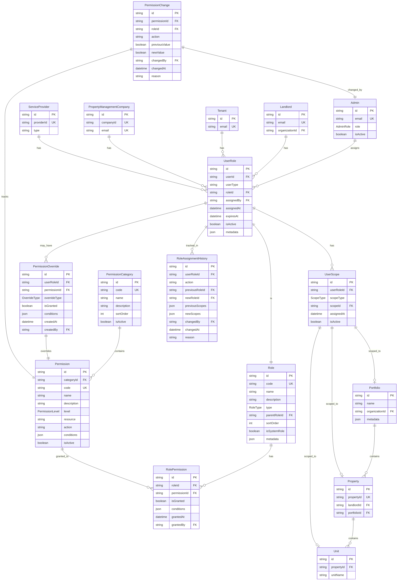

# RBAC Data Model - Visual Diagram

## Entity Relationship Diagram



## Data Model Structure

### 1. Core Entities

```
┌─────────────────────────────────────────────────────────────┐
│                    USER ENTITIES                             │
├─────────────────────────────────────────────────────────────┤
│  Admin                                                       │
│  Landlord                                                    │
│  Tenant                                                      │
│  PropertyManagementCompany (PMC)                            │
│  ServiceProvider (Vendor/Contractor)                        │
└─────────────────────────────────────────────────────────────┘
                            │
                            │ has
                            ▼
                    ┌───────────────┐
                    │   UserRole    │
                    └───────────────┘
```

### 2. Role & Permission System

```
┌─────────────────────────────────────────────────────────────┐
│                    PERMISSION SYSTEM                         │
├─────────────────────────────────────────────────────────────┤
│                                                               │
│  PermissionCategory (17 categories)                         │
│  ├── 1. Property Management                                  │
│  ├── 2. Unit Management                                      │
│  ├── 3. Tenant Management                                     │
│  ├── 4. Leasing & Applications                                │
│  ├── 5. Tenant Screening                                      │
│  ├── 6. Rent & Payments                                       │
│  ├── 7. Accounting                                            │
│  ├── 8. Reporting & Owner Statements                         │
│  ├── 9. Maintenance                                           │
│  ├── 10. Vendor Management                                   │
│  ├── 11. Communication & Messaging                            │
│  ├── 12. Document Management                                  │
│  ├── 13. Marketing / Listings                                │
│  ├── 14. Task Management                                     │
│  ├── 15. User & Role Management                              │
│  ├── 16. Property/Portfolio Assignment                       │
│  └── 17. System Settings (PMC-level)                         │
│                                                               │
│  Permission (specific actions within categories)              │
│  ├── resource: "property"                                    │
│  ├── action: "view" | "edit" | "delete" | "approve"         │
│  └── level: "full" | "view" | "edit" | "approve" | "submit"  │
│                                                               │
│  Role (9 core roles)                                         │
│  ├── SUPER_ADMIN                                              │
│  ├── PMC_ADMIN                                                │
│  ├── PROPERTY_MANAGER                                         │
│  ├── LEASING_AGENT                                            │
│  ├── MAINTENANCE_TECH                                         │
│  ├── ACCOUNTANT                                               │
│  ├── OWNER_LANDLORD                                           │
│  ├── TENANT                                                   │
│  └── VENDOR                                                   │
│                                                               │
│  RolePermission (junction: Role → Permission)                 │
│  └── Maps which permissions each role has                    │
│                                                               │
└─────────────────────────────────────────────────────────────┘
```

### 3. User Role Assignment

```
┌─────────────────────────────────────────────────────────────┐
│              USER ROLE ASSIGNMENT                            │
├─────────────────────────────────────────────────────────────┤
│                                                               │
│  User (Admin/Landlord/Tenant/PMC/ServiceProvider)            │
│         │                                                     │
│         │ can have multiple                                  │
│         ▼                                                     │
│  ┌─────────────────────────────────────┐                    │
│  │ UserRole                            │                    │
│  ├─────────────────────────────────────┤                    │
│  │ - userId                             │                    │
│  │ - userType: "admin" | "landlord" ... │                    │
│  │ - roleId                             │                    │
│  │ - assignedBy (Admin ID)              │                    │
│  │ - assignedAt                         │                    │
│  │ - expiresAt (optional)                │                    │
│  │ - isActive                           │                    │
│  └─────────────────────────────────────┘                    │
│         │                                                     │
│         │ has scopes                                         │
│         ▼                                                     │
│  ┌─────────────────────────────────────┐                    │
│  │ UserScope                            │                    │
│  ├─────────────────────────────────────┤                    │
│  │ - userRoleId                         │                    │
│  │ - scopeType: "portfolio" | "property"│                    │
│  │              | "unit"                 │                    │
│  │ - scopeId (ID of portfolio/property/ │                    │
│  │            unit)                      │                    │
│  │ - isActive                           │                    │
│  └─────────────────────────────────────┘                    │
│                                                               │
└─────────────────────────────────────────────────────────────┘
```

### 4. Scope Hierarchy

```
┌─────────────────────────────────────────────────────────────┐
│                    SCOPE HIERARCHY                            │
├─────────────────────────────────────────────────────────────┤
│                                                               │
│  Portfolio (optional grouping)                               │
│  │                                                             │
│  │ contains                                                    │
│  ▼                                                             │
│  Property                                                     │
│  │                                                             │
│  │ contains                                                    │
│  ▼                                                             │
│  Unit                                                         │
│                                                               │
│  Example:                                                     │
│  ┌─────────────────┐                                         │
│  │ Portfolio:      │                                         │
│  │ "Downtown"      │                                         │
│  └─────────────────┘                                         │
│         │                                                     │
│         ├── Property: "123 Main St"                           │
│         │         │                                           │
│         │         ├── Unit: "101"                              │
│         │         ├── Unit: "102"                              │
│         │         └── Unit: "103"                              │
│         │                                                     │
│         └── Property: "456 Oak Ave"                          │
│                   │                                           │
│                   ├── Unit: "201"                              │
│                   └── Unit: "202"                              │
│                                                               │
│  UserScope can be assigned at any level:                     │
│  - Portfolio level: access to all properties in portfolio   │
│  - Property level: access to specific property               │
│  - Unit level: access to specific unit                        │
│                                                               │
└─────────────────────────────────────────────────────────────┘
```

### 5. Permission Checking Flow

```
┌─────────────────────────────────────────────────────────────┐
│            PERMISSION CHECKING FLOW                          │
├─────────────────────────────────────────────────────────────┤
│                                                               │
│  1. User makes request                                       │
│     │                                                         │
│     ▼                                                         │
│  2. Get UserRoles for user                                   │
│     │                                                         │
│     ▼                                                         │
│  3. For each UserRole:                                       │
│     │                                                         │
│     ├── Get Role permissions                                 │
│     │   │                                                     │
│     │   └── RolePermission (Role → Permission)               │
│     │                                                         │
│     ├── Check PermissionOverrides                            │
│     │   │                                                     │
│     │   └── Override takes precedence                        │
│     │                                                         │
│     └── Check UserScope                                      │
│         │                                                     │
│         └── Filter by scope (portfolio/property/unit)        │
│                                                               │
│  4. Union all permissions from all UserRoles                 │
│     │                                                         │
│     ▼                                                         │
│  5. Check if permission exists for requested action          │
│     │                                                         │
│     ├── YES → Allow                                          │
│     │                                                         │
│     └── NO → Deny                                           │
│                                                               │
└─────────────────────────────────────────────────────────────┘
```

## Complete Data Model Overview

```
┌─────────────────────────────────────────────────────────────────┐
│                    RBAC DATA MODEL                             │
├─────────────────────────────────────────────────────────────────┤
│                                                                 │
│  ┌──────────────┐         ┌──────────────┐                    │
│  │    Users     │────────▶│  UserRole    │                    │
│  │ (Admin,      │         │              │                    │
│  │  Landlord,   │         │  - userId    │                    │
│  │  Tenant,     │         │  - roleId    │                    │
│  │  PMC, etc.)  │         │  - scopes[]  │                    │
│  └──────────────┘         └──────────────┘                    │
│         │                        │                             │
│         │                        │ references                  │
│         │                        ▼                             │
│         │              ┌──────────────┐                        │
│         │              │     Role     │                        │
│         │              │              │                        │
│         │              │  - SUPER_ADMIN│                        │
│         │              │  - PMC_ADMIN  │                        │
│         │              │  - PM, etc.   │                        │
│         │              └──────────────┘                        │
│         │                        │                             │
│         │                        │ has                         │
│         │                        ▼                             │
│         │              ┌──────────────────┐                   │
│         │              │  RolePermission   │                   │
│         │              │                   │                   │
│         │              │  - roleId         │                   │
│         │              │  - permissionId  │                   │
│         │              │  - isGranted     │                   │
│         │              └──────────────────┘                   │
│         │                        │                             │
│         │                        │ references                  │
│         │                        ▼                             │
│         │              ┌──────────────┐                        │
│         │              │  Permission  │                        │
│         │              │              │                        │
│         │              │  - resource │                        │
│         │              │  - action   │                        │
│         │              │  - level     │                        │
│         │              └──────────────┘                        │
│         │                        │                             │
│         │                        │ belongs to                 │
│         │                        ▼                             │
│         │              ┌──────────────────┐                   │
│         │              │PermissionCategory│                   │
│         │              │                  │                   │
│         │              │  (17 categories) │                   │
│         │              └──────────────────┘                   │
│         │                                                      │
│         │ scoped to                                            │
│         ▼                                                      │
│  ┌─────────────────────────────────────┐                     │
│  │         Scope Hierarchy              │                     │
│  │                                       │                     │
│  │  Portfolio → Property → Unit          │                     │
│  │                                       │                     │
│  │  UserScope links UserRole to scope    │                     │
│  └─────────────────────────────────────┘                     │
│                                                                 │
│  ┌─────────────────────────────────────┐                     │
│  │      Optional: Overrides            │                     │
│  │                                       │                     │
│  │  PermissionOverride                  │                     │
│  │  - Grant/deny specific permissions   │                     │
│  │  - Per user-role                     │                     │
│  └─────────────────────────────────────┘                     │
│                                                                 │
│  ┌─────────────────────────────────────┐                     │
│  │      Audit & History                │                     │
│  │                                       │                     │
│  │  RoleAssignmentHistory              │                     │
│  │  PermissionChange                   │                     │
│  └─────────────────────────────────────┘                     │
│                                                                 │
└─────────────────────────────────────────────────────────────────┘
```

## Key Relationships Summary

### 1. User → Role Assignment
- **One-to-Many**: One user can have multiple UserRoles
- **Many-to-One**: Each UserRole references one Role
- **Many-to-Many**: Each UserRole can have multiple UserScopes

### 2. Role → Permission Assignment
- **Many-to-Many**: Roles have multiple Permissions via RolePermission
- **One-to-Many**: Each Permission belongs to one PermissionCategory

### 3. Scope Assignment
- **Many-to-One**: UserScope references one scope (Portfolio/Property/Unit)
- **One-to-Many**: UserRole can have multiple UserScopes

### 4. Permission Overrides
- **One-to-Many**: UserRole can have multiple PermissionOverrides
- **Many-to-One**: Each PermissionOverride references one Permission

## Example Data Flow

### Scenario: PM wants to view a property

```
1. User: "john@pmc.com" (Property Manager)
   │
   ▼
2. Get UserRoles for "john@pmc.com"
   └── UserRole {
         userId: "john-id",
         roleId: "PROPERTY_MANAGER",
         scopes: [
           { type: "property", id: "prop-123" },
           { type: "property", id: "prop-456" }
         ]
       }
   │
   ▼
3. Get Role permissions for "PROPERTY_MANAGER"
   └── RolePermission {
         roleId: "PROPERTY_MANAGER",
         permissionId: "property.view",
         isGranted: true
       }
   │
   ▼
4. Check UserScope
   └── User has access to "prop-123" and "prop-456"
   │
   ▼
5. Check if requested property is in scope
   └── Request: "prop-123" ✅ ALLOWED
   └── Request: "prop-999" ❌ DENIED (not in scope)
```

## Database Schema Summary

### New Tables Needed:
1. **Role** - Defines the 9 core roles
2. **PermissionCategory** - 17 permission categories
3. **Permission** - Specific permissions within categories
4. **RolePermission** - Maps roles to permissions
5. **UserRole** - Assigns roles to users
6. **UserScope** - Assigns scopes to user roles
7. **PermissionOverride** - Custom permission overrides (optional)
8. **RoleAssignmentHistory** - Audit trail of role changes
9. **PermissionChange** - Audit trail of permission changes
10. **Portfolio** - Portfolio grouping (optional, if needed)

### Modified Tables:
- **Admin** - Already has `role` field (AdminRole enum)
- **Landlord** - No changes needed (linked via UserRole)
- **Tenant** - No changes needed (linked via UserRole)
- **PropertyManagementCompany** - No changes needed (linked via UserRole)

---

This diagram shows the complete RBAC data model structure. Would you like me to:
1. Create the actual Prisma schema based on this?
2. Add more detail to any specific part?
3. Create example queries showing how permission checking works?

