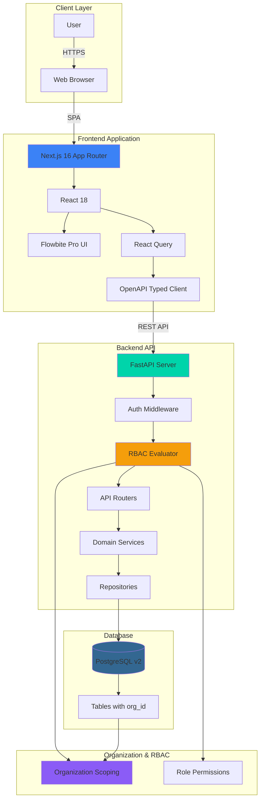
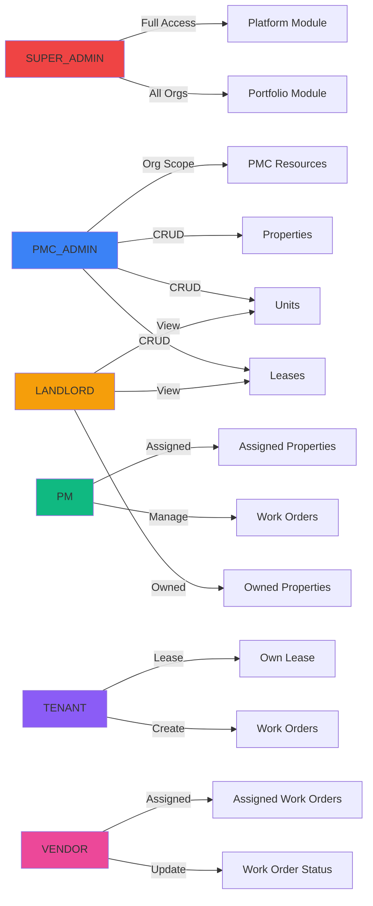

# System Overview Diagram

## Pinaka v2 System Architecture

```mermaid
flowchart TB
    subgraph "Client Layer"
        Browser[Web Browser]
        User[User]
    end
    
    subgraph "Frontend Application"
        NextJS[Next.js 16 App Router]
        React[React 18]
        Flowbite[Flowbite Pro UI]
        ReactQuery[React Query]
        APIClient[OpenAPI Typed Client]
    end
    
    subgraph "Backend API"
        FastAPI[FastAPI Server]
        Auth[Auth Middleware]
        RBAC[RBAC Evaluator]
        Routers[API Routers]
        Services[Domain Services]
        Repos[Repositories]
    end
    
    subgraph "Database"
        PostgreSQL[(PostgreSQL v2)]
        Tables[Tables with org_id]
    end
    
    subgraph "Organization & RBAC"
        OrgScope[Organization Scoping]
        RolePerms[Role Permissions]
    end
    
    User -->|HTTPS| Browser
    Browser -->|SPA| NextJS
    NextJS --> React
    React --> Flowbite
    React --> ReactQuery
    ReactQuery --> APIClient
    APIClient -->|REST API| FastAPI
    
    FastAPI --> Auth
    Auth --> RBAC
    RBAC --> OrgScope
    RBAC --> RolePerms
    RBAC --> Routers
    Routers --> Services
    Services --> Repos
    Repos --> PostgreSQL
    
    PostgreSQL --> Tables
    Tables --> OrgScope
    
    style NextJS fill:#3b82f6
    style FastAPI fill:#00d4aa
    style PostgreSQL fill:#336791
    style RBAC fill:#f59e0b
    style OrgScope fill:#8b5cf6
```

## Role-Based Access

```mermaid
flowchart LR
    SuperAdmin[SUPER_ADMIN] -->|Full Access| Platform[Platform Module]
    SuperAdmin -->|All Orgs| Portfolio[Portfolio Module]
    
    PMCAdmin[PMC_ADMIN] -->|Org Scope| PMC[PMC Resources]
    PMCAdmin -->|CRUD| Properties[Properties]
    PMCAdmin -->|CRUD| Units[Units]
    PMCAdmin -->|CRUD| Leases[Leases]
    
    PM[PM] -->|Assigned| AssignedProps[Assigned Properties]
    PM -->|Manage| WorkOrders[Work Orders]
    
    Landlord[LANDLORD] -->|Owned| OwnedProps[Owned Properties]
    Landlord -->|View| Units
    Landlord -->|View| Leases
    
    Tenant[TENANT] -->|Lease| Lease[Own Lease]
    Tenant -->|Create| WOTenant[Work Orders]
    
    Vendor[VENDOR] -->|Assigned| WOAssign[Assigned Work Orders]
    Vendor -->|Update| WOStatus[Work Order Status]
    
    style SuperAdmin fill:#ef4444
    style PMCAdmin fill:#3b82f6
    style PM fill:#10b981
    style Landlord fill:#f59e0b
    style Tenant fill:#8b5cf6
    style Vendor fill:#ec4899
```

