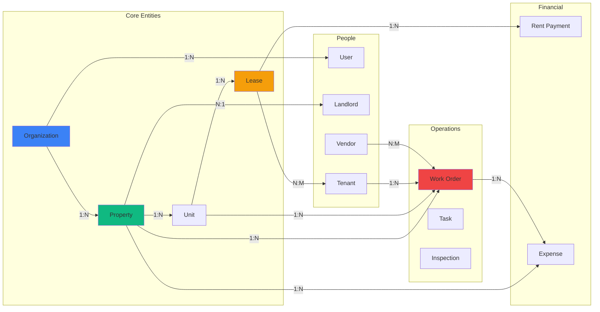

# DDD Bounded Contexts Diagram

## Pinaka v2 Domain-Driven Design Architecture

```mermaid
graph TB
    subgraph "Shared Kernel"
        User[User Domain]
        Organization[Organization Domain]
        Auth[Authentication Domain]
    end
    
    subgraph "Portfolio Bounded Context"
        Property[Property Domain]
        Unit[Unit Domain]
        Lease[Lease Domain]
        Landlord[Landlord Domain]
        Tenant[Tenant Domain]
        Vendor[Vendor Domain]
    end
    
    subgraph "Maintenance Bounded Context"
        WorkOrder[Work Order Domain]
        WOComment[Work Order Comments]
        WOAssignment[Work Order Assignments]
    end
    
    subgraph "Financial Bounded Context"
        RentPayment[Rent Payment Domain]
        Expense[Expense Domain]
    end
    
    subgraph "Communication Bounded Context"
        Conversation[Conversation Domain]
        Message[Message Domain]
        Notification[Notification Domain]
    end
    
    subgraph "Document Bounded Context"
        Form[Form Domain]
        FormSignature[Form Signatures]
        Attachment[Attachment Domain]
    end
    
    subgraph "Operations Bounded Context"
        Task[Task/Calendar Domain]
        Inspection[Inspection Domain]
        Invitation[Invitation Domain]
    end
    
    subgraph "Platform Bounded Context"
        RBAC[RBAC Domain]
        AuditLog[Audit Log Domain]
        Onboarding[Onboarding Domain]
    end
    
    %% Shared Kernel Dependencies
    Property -.->|Uses| Organization
    Property -.->|Uses| User
    Lease -.->|Uses| Organization
    WorkOrder -.->|Uses| Property
    WorkOrder -.->|Uses| Tenant
    RentPayment -.->|Uses| Lease
    Conversation -.->|Uses| User
    Form -.->|Uses| Lease
    Task -.->|Uses| Property
    
    %% Context Dependencies
    Portfolio -->|Depends on| SharedKernel[Shared Kernel]
    Maintenance -->|Depends on| Portfolio
    Financial -->|Depends on| Portfolio
    Communication -->|Depends on| SharedKernel
    Document -->|Depends on| Portfolio
    Operations -->|Depends on| Portfolio
    Platform -->|Depends on| SharedKernel
    
    style SharedKernel fill:#e0e7ff
    style Portfolio fill:#dbeafe
    style Maintenance fill:#fef3c7
    style Financial fill:#d1fae5
    style Communication fill:#fce7f3
    style Document fill:#f3e8ff
    style Operations fill:#fed7aa
    style Platform fill:#fee2e2
```

## Domain Relationships

```mermaid
graph LR
    subgraph "Core Entities"
        Org[Organization]
        Prop[Property]
        Unit[Unit]
        Lease[Lease]
    end
    
    subgraph "People"
        User[User]
        Landlord[Landlord]
        Tenant[Tenant]
        Vendor[Vendor]
    end
    
    subgraph "Operations"
        WO[Work Order]
        Task[Task]
        Insp[Inspection]
    end
    
    subgraph "Financial"
        Rent[Rent Payment]
        Exp[Expense]
    end
    
    Org -->|1:N| Prop
    Org -->|1:N| User
    Prop -->|1:N| Unit
    Unit -->|1:N| Lease
    Lease -->|N:M| Tenant
    Prop -->|N:1| Landlord
    Prop -->|1:N| WO
    Unit -->|1:N| WO
    Tenant -->|1:N| WO
    Vendor -->|N:M| WO
    Lease -->|1:N| Rent
    Prop -->|1:N| Exp
    WO -->|1:N| Exp
    
    style Org fill:#3b82f6
    style Prop fill:#10b981
    style Lease fill:#f59e0b
    style WO fill:#ef4444
```

