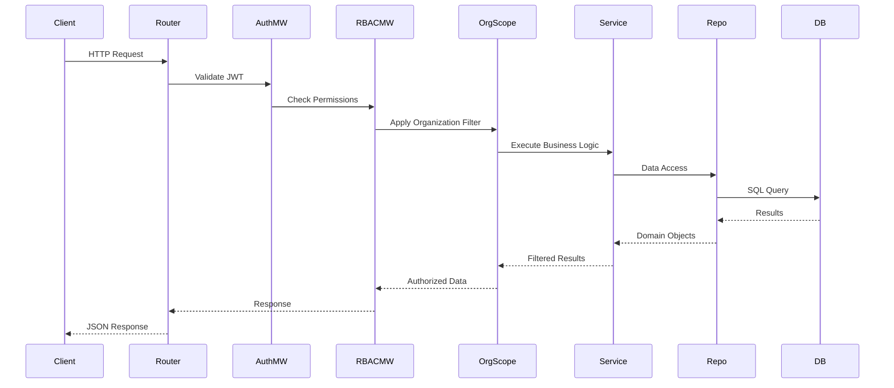

# Backend Service Layer Diagram

## Pinaka v2 Backend Architecture

```mermaid
flowchart TB
    subgraph "API Layer"
        Router1[Properties Router]
        Router2[Leases Router]
        Router3[Work Orders Router]
        Router4[Tenants Router]
        Router5[Landlords Router]
        Router6[Users Router]
        Router7[Organizations Router]
        Router8[Auth Router]
        Router9[RBAC Router]
        Router10[Other Routers...]
    end
    
    subgraph "Middleware Layer"
        AuthMW[Auth Middleware]
        RBACMW[RBAC Middleware]
        OrgScopeMW[Organization Scoping]
    end
    
    subgraph "Service Layer"
        PropService[Property Service]
        LeaseService[Lease Service]
        WOService[Work Order Service]
        TenantService[Tenant Service]
        LandlordService[Landlord Service]
        UserService[User Service]
        OrgService[Organization Service]
    end
    
    subgraph "Repository Layer"
        PropRepo[Property Repository]
        LeaseRepo[Lease Repository]
        WORepo[Work Order Repository]
        TenantRepo[Tenant Repository]
        LandlordRepo[Landlord Repository]
        UserRepo[User Repository]
        OrgRepo[Organization Repository]
    end
    
    subgraph "Database Layer"
        Models[SQLAlchemy Models]
        DB[(PostgreSQL)]
    end
    
    Router1 --> AuthMW
    Router2 --> AuthMW
    Router3 --> AuthMW
    Router4 --> AuthMW
    Router5 --> AuthMW
    Router6 --> AuthMW
    Router7 --> AuthMW
    Router8 --> AuthMW
    Router9 --> AuthMW
    Router10 --> AuthMW
    
    AuthMW --> RBACMW
    RBACMW --> OrgScopeMW
    
    Router1 --> PropService
    Router2 --> LeaseService
    Router3 --> WOService
    Router4 --> TenantService
    Router5 --> LandlordService
    Router6 --> UserService
    Router7 --> OrgService
    
    PropService --> PropRepo
    LeaseService --> LeaseRepo
    WOService --> WORepo
    TenantService --> TenantRepo
    LandlordService --> LandlordRepo
    UserService --> UserRepo
    OrgService --> OrgRepo
    
    PropRepo --> Models
    LeaseRepo --> Models
    WORepo --> Models
    TenantRepo --> Models
    LandlordRepo --> Models
    UserRepo --> Models
    OrgRepo --> Models
    
    Models --> DB
    
    style AuthMW fill:#ef4444
    style RBACMW fill:#f59e0b
    style OrgScopeMW fill:#8b5cf6
    style DB fill:#336791
```

## Request Flow with RBAC

```mermaid
sequenceDiagram
    participant Client
    participant Router
    participant AuthMW
    participant RBACMW
    participant OrgScope
    participant Service
    participant Repo
    participant DB
    
    Client->>Router: HTTP Request
    Router->>AuthMW: Validate JWT
    AuthMW->>RBACMW: Check Permissions
    RBACMW->>OrgScope: Apply Organization Filter
    OrgScope->>Service: Execute Business Logic
    Service->>Repo: Data Access
    Repo->>DB: SQL Query
    DB-->>Repo: Results
    Repo-->>Service: Domain Objects
    Service-->>OrgScope: Filtered Results
    OrgScope-->>RBACMW: Authorized Data
    RBACMW-->>Router: Response
    Router-->>Client: JSON Response
```

