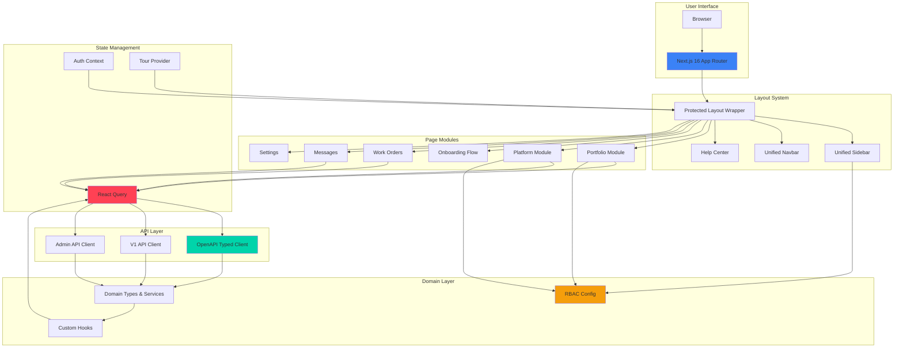
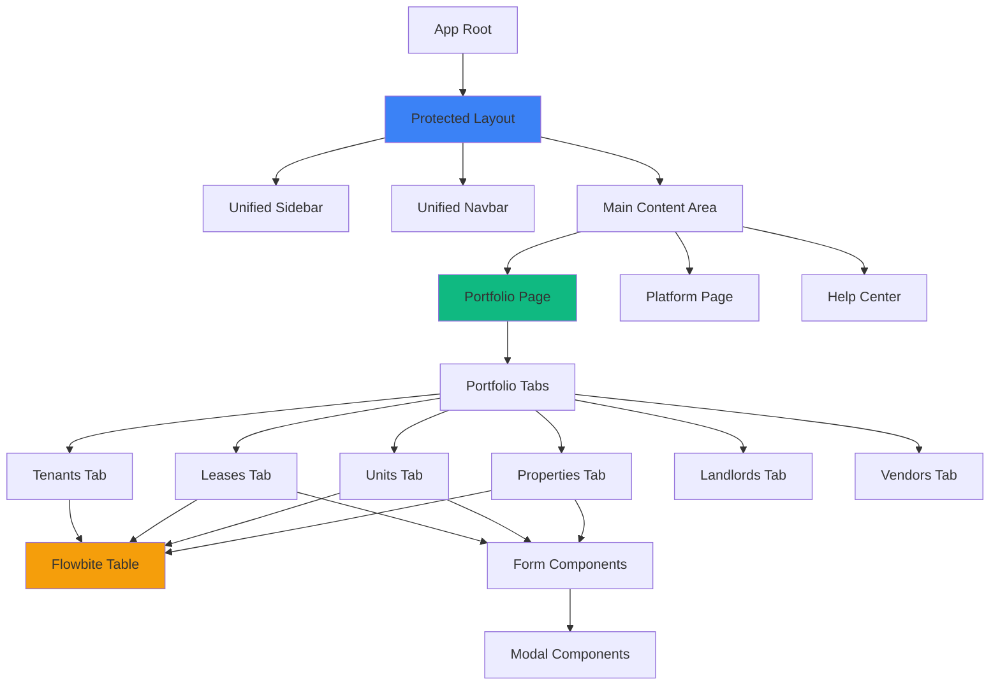

# Frontend Architecture Diagram

## Pinaka v2 Frontend Structure

```mermaid
flowchart TB
    subgraph "User Interface"
        Browser[Browser]
        NextJS[Next.js 16 App Router]
    end
    
    subgraph "Layout System"
        ProtectedLayout[Protected Layout Wrapper]
        UnifiedSidebar[Unified Sidebar]
        UnifiedNavbar[Unified Navbar]
        HelpCenter[Help Center]
    end
    
    subgraph "Page Modules"
        Portfolio[Portfolio Module]
        Platform[Platform Module]
        Onboarding[Onboarding Flow]
        WorkOrders[Work Orders]
        Messages[Messages]
        Settings[Settings]
    end
    
    subgraph "State Management"
        ReactQuery[React Query]
        AuthContext[Auth Context]
        TourProvider[Tour Provider]
    end
    
    subgraph "API Layer"
        APIClient[OpenAPI Typed Client]
        V1Client[V1 API Client]
        AdminAPI[Admin API Client]
    end
    
    subgraph "Domain Layer"
        Domains[Domain Types & Services]
        RBACConfig[RBAC Config]
        Hooks[Custom Hooks]
    end
    
    Browser --> NextJS
    NextJS --> ProtectedLayout
    ProtectedLayout --> UnifiedSidebar
    ProtectedLayout --> UnifiedNavbar
    ProtectedLayout --> HelpCenter
    ProtectedLayout --> Portfolio
    ProtectedLayout --> Platform
    ProtectedLayout --> Onboarding
    ProtectedLayout --> WorkOrders
    ProtectedLayout --> Messages
    ProtectedLayout --> Settings
    
    Portfolio --> ReactQuery
    Platform --> ReactQuery
    WorkOrders --> ReactQuery
    Messages --> ReactQuery
    
    ReactQuery --> APIClient
    ReactQuery --> V1Client
    ReactQuery --> AdminAPI
    
    UnifiedSidebar --> RBACConfig
    Portfolio --> RBACConfig
    Platform --> RBACConfig
    
    APIClient --> Domains
    V1Client --> Domains
    AdminAPI --> Domains
    
    Domains --> Hooks
    Hooks --> ReactQuery
    
    AuthContext --> ProtectedLayout
    TourProvider --> ProtectedLayout
    
    style NextJS fill:#3b82f6
    style ReactQuery fill:#ff4154
    style APIClient fill:#00d4aa
    style RBACConfig fill:#f59e0b
```

## Component Hierarchy

```mermaid
graph TD
    App[App Root]
    Layout[Protected Layout]
    Sidebar[Unified Sidebar]
    Navbar[Unified Navbar]
    Main[Main Content Area]
    
    PortfolioPage[Portfolio Page]
    PlatformPage[Platform Page]
    HelpPage[Help Center]
    
    PortfolioTabs[Portfolio Tabs]
    PropertiesTab[Properties Tab]
    UnitsTab[Units Tab]
    LeasesTab[Leases Tab]
    TenantsTab[Tenants Tab]
    LandlordsTab[Landlords Tab]
    VendorsTab[Vendors Tab]
    
    FlowbiteTable[Flowbite Table]
    FormComponents[Form Components]
    Modals[Modal Components]
    
    App --> Layout
    Layout --> Sidebar
    Layout --> Navbar
    Layout --> Main
    
    Main --> PortfolioPage
    Main --> PlatformPage
    Main --> HelpPage
    
    PortfolioPage --> PortfolioTabs
    PortfolioTabs --> PropertiesTab
    PortfolioTabs --> UnitsTab
    PortfolioTabs --> LeasesTab
    PortfolioTabs --> TenantsTab
    PortfolioTabs --> LandlordsTab
    PortfolioTabs --> VendorsTab
    
    PropertiesTab --> FlowbiteTable
    UnitsTab --> FlowbiteTable
    LeasesTab --> FlowbiteTable
    TenantsTab --> FlowbiteTable
    
    PropertiesTab --> FormComponents
    UnitsTab --> FormComponents
    LeasesTab --> FormComponents
    
    FormComponents --> Modals
    
    style Layout fill:#3b82f6
    style PortfolioPage fill:#10b981
    style FlowbiteTable fill:#f59e0b
```

