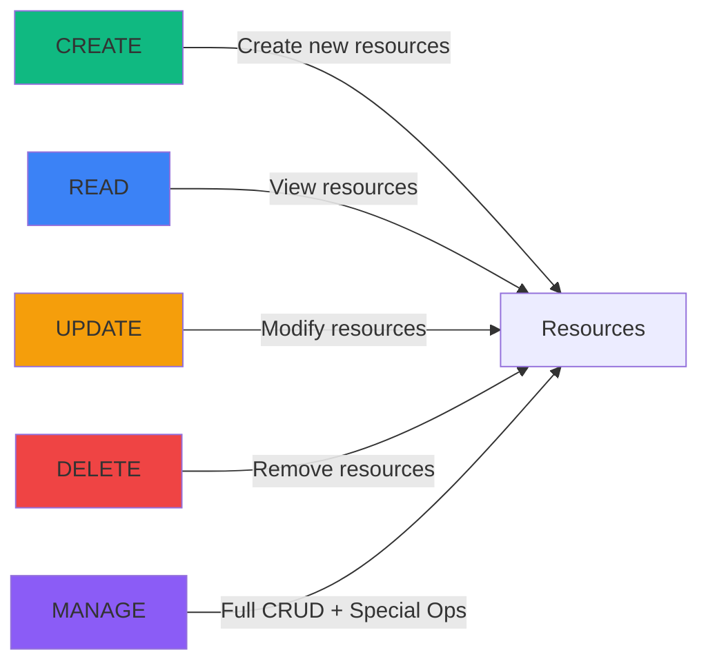

# RBAC Permission Matrix Diagram

## Pinaka v2 Role-Based Access Control

```mermaid
graph TB
    subgraph "Roles"
        SA[SUPER_ADMIN]
        PA[PMC_ADMIN]
        PM[PM]
        LL[LANDLORD]
        TN[TENANT]
        VD[VENDOR]
    end
    
    subgraph "Resources"
        ORG[Organization]
        USR[User]
        PROP[Property]
        UNIT[Unit]
        LL2[Landlord]
        TN2[Tenant]
        LEASE[Lease]
        VEND[Vendor]
        WO[Work Order]
        ATT[Attachment]
        MSG[Message]
        NOT[Notification]
        AUD[Audit Log]
        TASK[Task]
        CONV[Conversation]
        INV[Invitation]
        FORM[Form]
        RENT[Rent Payment]
        EXP[Expense]
        INS[Inspection]
    end
    
    SA -->|ALL| ORG
    SA -->|ALL| USR
    SA -->|ALL| PROP
    SA -->|ALL| UNIT
    SA -->|ALL| LL2
    SA -->|ALL| TN2
    SA -->|ALL| LEASE
    SA -->|ALL| VEND
    SA -->|ALL| WO
    SA -->|ALL| ATT
    SA -->|ALL| MSG
    SA -->|ALL| NOT
    SA -->|READ| AUD
    SA -->|ALL| TASK
    SA -->|ALL| CONV
    SA -->|ALL| INV
    SA -->|ALL| FORM
    SA -->|ALL| RENT
    SA -->|ALL| EXP
    SA -->|ALL| INS
    
    PA -->|READ/UPDATE| ORG
    PA -->|CREATE/READ/UPDATE| USR
    PA -->|CRUD| PROP
    PA -->|CRUD| UNIT
    PA -->|CRUD| LL2
    PA -->|CRUD| TN2
    PA -->|CRUD| LEASE
    PA -->|CRUD| VEND
    PA -->|CRUD| WO
    PA -->|CRUD| ATT
    PA -->|CREATE/READ/UPDATE| MSG
    PA -->|READ/UPDATE| NOT
    PA -->|READ| AUD
    PA -->|CRUD| TASK
    PA -->|CRUD| CONV
    PA -->|CRUD| INV
    PA -->|CRUD| FORM
    PA -->|CRUD| RENT
    PA -->|CRUD| EXP
    PA -->|CRUD| INS
    
    PM -->|READ| PROP
    PM -->|READ/UPDATE| UNIT
    PM -->|READ| LL2
    PM -->|READ/UPDATE| TN2
    PM -->|CREATE/READ/UPDATE| LEASE
    PM -->|READ| VEND
    PM -->|CRUD| WO
    PM -->|CREATE/READ| ATT
    PM -->|CREATE/READ/UPDATE| MSG
    PM -->|READ/UPDATE| NOT
    PM -->|CRUD| TASK
    PM -->|CRUD| CONV
    PM -->|CREATE/READ| FORM
    PM -->|READ| RENT
    PM -->|READ| EXP
    PM -->|CRUD| INS
    
    LL -->|READ| PROP
    LL -->|READ| UNIT
    LL -->|READ| LL2
    LL -->|READ| TN2
    LL -->|READ| LEASE
    LL -->|READ| VEND
    LL -->|CREATE/READ/UPDATE| WO
    LL -->|CREATE/READ| ATT
    LL -->|CREATE/READ/UPDATE| MSG
    LL -->|READ/UPDATE| NOT
    LL -->|READ| TASK
    LL -->|CRUD| CONV
    LL -->|READ| RENT
    LL -->|CREATE/READ/UPDATE| EXP
    LL -->|READ| INS
    
    TN -->|READ| PROP
    TN -->|READ| UNIT
    TN -->|READ| LEASE
    TN -->|CREATE/READ/UPDATE| WO
    TN -->|CREATE/READ| ATT
    TN -->|CREATE/READ/UPDATE| MSG
    TN -->|READ/UPDATE| NOT
    TN -->|READ| TASK
    TN -->|CRUD| CONV
    TN -->|CREATE/READ/UPDATE| RENT
    TN -->|READ| INS
    
    VD -->|READ| PROP
    VD -->|READ| UNIT
    VD -->|READ/UPDATE| WO
    VD -->|CREATE/READ| ATT
    VD -->|CREATE/READ/UPDATE| MSG
    VD -->|READ/UPDATE| NOT
    VD -->|READ| TASK
    VD -->|CRUD| CONV
    
    style SA fill:#ef4444
    style PA fill:#3b82f6
    style PM fill:#10b981
    style LL fill:#f59e0b
    style TN fill:#8b5cf6
    style VD fill:#ec4899
```

## Permission Actions

```mermaid
graph LR
    CREATE[CREATE]
    READ[READ]
    UPDATE[UPDATE]
    DELETE[DELETE]
    MANAGE[MANAGE]
    
    CREATE -->|Create new resources| Resources[Resources]
    READ -->|View resources| Resources
    UPDATE -->|Modify resources| Resources
    DELETE -->|Remove resources| Resources
    MANAGE -->|Full CRUD + Special Ops| Resources
    
    style CREATE fill:#10b981
    style READ fill:#3b82f6
    style UPDATE fill:#f59e0b
    style DELETE fill:#ef4444
    style MANAGE fill:#8b5cf6
```

