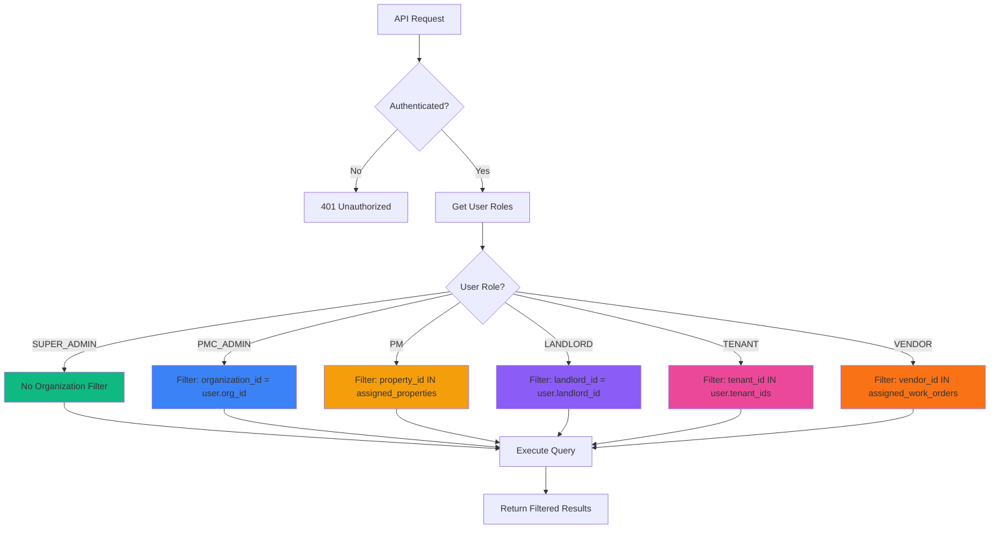

# Organization Scoping Diagram

## Pinaka v2 Multi-Tenant Organization Scoping

```mermaid
flowchart TB
    subgraph "Organization Hierarchy"
        Org1[Organization 1<br/>PMC]
        Org2[Organization 2<br/>Landlord]
        Org3[Organization 3<br/>PMC]
    end
    
    subgraph "SUPER_ADMIN Scope"
        SA[Super Admin]
        SA -->|Global Access| AllOrgs[All Organizations]
        SA -->|No Filter| AllData[All Data]
    end
    
    subgraph "PMC_ADMIN Scope"
        PA[PMC Admin]
        PA -->|Own Org| Org1
        PA -->|Filter: org_id| Org1Data[Org 1 Data Only]
    end
    
    subgraph "PM Scope"
        PM[Property Manager]
        PM -->|Assigned Properties| AssignedProps[Assigned Properties Only]
        PM -->|Filter: property_id IN assigned| PMData[PM Scoped Data]
    end
    
    subgraph "LANDLORD Scope"
        LL[Landlord]
        LL -->|Owned Properties| OwnedProps[Owned Properties Only]
        LL -->|Filter: landlord_id| LLData[Landlord Scoped Data]
    end
    
    subgraph "TENANT Scope"
        TN[Tenant]
        TN -->|Own Lease| OwnLease[Own Lease Only]
        TN -->|Filter: tenant_id IN lease_tenants| TNData[Tenant Scoped Data]
    end
    
    subgraph "VENDOR Scope"
        VD[Vendor]
        VD -->|Assigned Work Orders| AssignedWO[Assigned Work Orders Only]
        VD -->|Filter: vendor_id IN assignments| VDData[Vendor Scoped Data]
    end
    
    style SA fill:#ef4444
    style PA fill:#3b82f6
    style PM fill:#10b981
    style LL fill:#f59e0b
    style TN fill:#8b5cf6
    style VD fill:#ec4899
```

## Scoping Rules

```mermaid
graph TD
    Request[API Request] --> Auth{Authenticated?}
    Auth -->|No| Reject[401 Unauthorized]
    Auth -->|Yes| GetRoles[Get User Roles]
    GetRoles --> CheckRole{User Role?}
    
    CheckRole -->|SUPER_ADMIN| NoFilter[No Organization Filter]
    CheckRole -->|PMC_ADMIN| OrgFilter[Filter: organization_id = user.org_id]
    CheckRole -->|PM| PropFilter[Filter: property_id IN assigned_properties]
    CheckRole -->|LANDLORD| LandlordFilter[Filter: landlord_id = user.landlord_id]
    CheckRole -->|TENANT| TenantFilter[Filter: tenant_id IN user.tenant_ids]
    CheckRole -->|VENDOR| VendorFilter[Filter: vendor_id IN assigned_work_orders]
    
    NoFilter --> Execute[Execute Query]
    OrgFilter --> Execute
    PropFilter --> Execute
    LandlordFilter --> Execute
    TenantFilter --> Execute
    VendorFilter --> Execute
    
    Execute --> Return[Return Filtered Results]
    
    style NoFilter fill:#10b981
    style OrgFilter fill:#3b82f6
    style PropFilter fill:#f59e0b
    style LandlordFilter fill:#8b5cf6
    style TenantFilter fill:#ec4899
    style VendorFilter fill:#f97316
```

