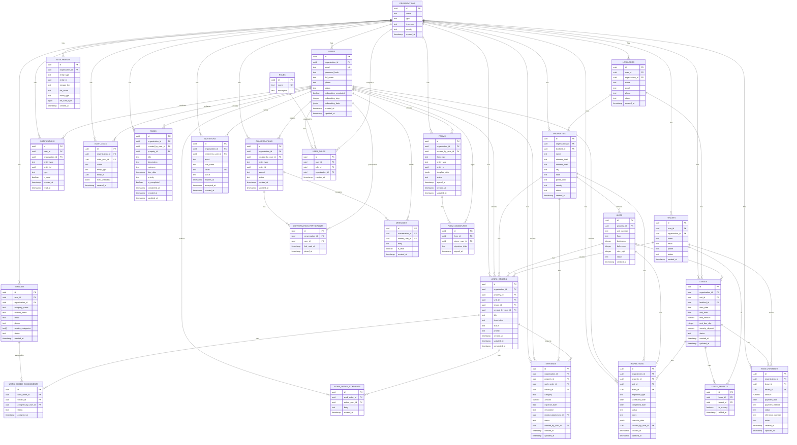

# Database ERD (Entity Relationship Diagram)

## Pinaka v2 Database Schema

```mermaid
erDiagram
    ORGANIZATIONS ||--o{ USERS : "has"
    ORGANIZATIONS ||--o{ PROPERTIES : "has"
    ORGANIZATIONS ||--o{ LANDLORDS : "has"
    ORGANIZATIONS ||--o{ TENANTS : "has"
    ORGANIZATIONS ||--o{ VENDORS : "has"
    ORGANIZATIONS ||--o{ LEASES : "has"
    ORGANIZATIONS ||--o{ WORK_ORDERS : "has"
    ORGANIZATIONS ||--o{ ATTACHMENTS : "has"
    ORGANIZATIONS ||--o{ NOTIFICATIONS : "has"
    ORGANIZATIONS ||--o{ AUDIT_LOGS : "has"
    ORGANIZATIONS ||--o{ TASKS : "has"
    ORGANIZATIONS ||--o{ CONVERSATIONS : "has"
    ORGANIZATIONS ||--o{ INVITATIONS : "has"
    ORGANIZATIONS ||--o{ FORMS : "has"
    ORGANIZATIONS ||--o{ RENT_PAYMENTS : "has"
    ORGANIZATIONS ||--o{ EXPENSES : "has"
    ORGANIZATIONS ||--o{ INSPECTIONS : "has"
    
    USERS ||--o{ USER_ROLES : "has"
    ROLES ||--o{ USER_ROLES : "assigned to"
    ORGANIZATIONS ||--o{ USER_ROLES : "scoped to"
    
    USERS ||--o{ WORK_ORDERS : "creates"
    USERS ||--o{ WORK_ORDER_COMMENTS : "authors"
    USERS ||--o{ NOTIFICATIONS : "receives"
    USERS ||--o{ AUDIT_LOGS : "performs"
    USERS ||--o{ TASKS : "creates"
    USERS ||--o{ CONVERSATIONS : "creates"
    USERS ||--o{ INVITATIONS : "sends"
    USERS ||--o{ FORMS : "creates"
    USERS ||--o{ EXPENSES : "creates"
    USERS ||--o{ INSPECTIONS : "creates"
    
    LANDLORDS ||--o{ PROPERTIES : "owns"
    LANDLORDS ||--o{ LEASES : "has"
    
    PROPERTIES ||--o{ UNITS : "contains"
    PROPERTIES ||--o{ WORK_ORDERS : "has"
    PROPERTIES ||--o{ EXPENSES : "has"
    PROPERTIES ||--o{ INSPECTIONS : "has"
    
    UNITS ||--o{ LEASES : "has"
    UNITS ||--o{ WORK_ORDERS : "has"
    UNITS ||--o{ INSPECTIONS : "has"
    
    LEASES ||--o{ LEASE_TENANTS : "has"
    TENANTS ||--o{ LEASE_TENANTS : "in"
    LEASES ||--o{ RENT_PAYMENTS : "has"
    LEASES ||--o{ INSPECTIONS : "has"
    
    TENANTS ||--o{ WORK_ORDERS : "creates"
    TENANTS ||--o{ RENT_PAYMENTS : "makes"
    
    VENDORS ||--o{ WORK_ORDER_ASSIGNMENTS : "assigned to"
    WORK_ORDERS ||--o{ WORK_ORDER_ASSIGNMENTS : "has"
    WORK_ORDERS ||--o{ WORK_ORDER_COMMENTS : "has"
    WORK_ORDERS ||--o{ EXPENSES : "linked to"
    
    CONVERSATIONS ||--o{ CONVERSATION_PARTICIPANTS : "has"
    USERS ||--o{ CONVERSATION_PARTICIPANTS : "participates"
    CONVERSATIONS ||--o{ MESSAGES : "contains"
    USERS ||--o{ MESSAGES : "sends"
    
    FORMS ||--o{ FORM_SIGNATURES : "has"
    USERS ||--o{ FORM_SIGNATURES : "signs"
    
    ORGANIZATIONS {
        uuid id PK
        text name
        text type
        text timezone
        text country
        timestamp created_at
    }
    
    USERS {
        uuid id PK
        uuid organization_id FK
        text email UK
        text password_hash
        text full_name
        text phone
        text status
        boolean onboarding_completed
        integer onboarding_step
        jsonb onboarding_data
        timestamp created_at
        timestamp updated_at
    }
    
    ROLES {
        uuid id PK
        text name UK
        text description
    }
    
    USER_ROLES {
        uuid id PK
        uuid user_id FK
        uuid role_id FK
        uuid organization_id FK
        timestamp created_at
    }
    
    PROPERTIES {
        uuid id PK
        uuid organization_id FK
        uuid landlord_id FK
        text name
        text address_line1
        text address_line2
        text city
        text state
        text postal_code
        text country
        text status
        timestamp created_at
    }
    
    UNITS {
        uuid id PK
        uuid property_id FK
        text unit_number
        text floor
        integer bedrooms
        integer bathrooms
        integer size_sqft
        text status
        timestamp created_at
    }
    
    LANDLORDS {
        uuid id PK
        uuid user_id FK
        uuid organization_id FK
        text name
        text email
        text phone
        text status
        timestamp created_at
    }
    
    TENANTS {
        uuid id PK
        uuid user_id FK
        uuid organization_id FK
        text name
        text email
        text phone
        text status
        timestamp created_at
    }
    
    VENDORS {
        uuid id PK
        uuid user_id FK
        uuid organization_id FK
        text company_name
        text contact_name
        text email
        text phone
        text[] service_categories
        text status
        timestamp created_at
    }
    
    LEASES {
        uuid id PK
        uuid organization_id FK
        uuid unit_id FK
        uuid landlord_id FK
        date start_date
        date end_date
        numeric rent_amount
        integer rent_due_day
        numeric security_deposit
        text status
        timestamp created_at
        timestamp updated_at
    }
    
    LEASE_TENANTS {
        uuid id PK
        uuid lease_id FK
        uuid tenant_id FK
        boolean is_primary
        timestamp added_at
    }
    
    WORK_ORDERS {
        uuid id PK
        uuid organization_id FK
        uuid property_id FK
        uuid unit_id FK
        uuid tenant_id FK
        uuid created_by_user_id FK
        text title
        text description
        text status
        text priority
        timestamp created_at
        timestamp updated_at
        timestamp completed_at
    }
    
    WORK_ORDER_ASSIGNMENTS {
        uuid id PK
        uuid work_order_id FK
        uuid vendor_id FK
        uuid assigned_by_user_id FK
        text status
        timestamp assigned_at
    }
    
    WORK_ORDER_COMMENTS {
        uuid id PK
        uuid work_order_id FK
        uuid author_user_id FK
        text body
        timestamp created_at
    }
    
    ATTACHMENTS {
        uuid id PK
        uuid organization_id FK
        text entity_type
        uuid entity_id
        text storage_key
        text file_name
        text mime_type
        bigint file_size_bytes
        timestamp created_at
    }
    
    NOTIFICATIONS {
        uuid id PK
        uuid user_id FK
        uuid organization_id FK
        text entity_type
        uuid entity_id
        text type
        boolean is_read
        timestamp created_at
        timestamp read_at
    }
    
    AUDIT_LOGS {
        uuid id PK
        uuid organization_id FK
        uuid actor_user_id FK
        text action
        text entity_type
        uuid entity_id
        jsonb extra_metadata
        timestamp created_at
    }
    
    TASKS {
        uuid id PK
        uuid organization_id FK
        uuid created_by_user_id FK
        uuid property_id FK
        text title
        text description
        text category
        timestamp due_date
        text priority
        boolean is_completed
        timestamp completed_at
        timestamp created_at
        timestamp updated_at
    }
    
    CONVERSATIONS {
        uuid id PK
        uuid organization_id FK
        uuid created_by_user_id FK
        text entity_type
        uuid entity_id
        text subject
        text status
        timestamp created_at
        timestamp updated_at
    }
    
    CONVERSATION_PARTICIPANTS {
        uuid id PK
        uuid conversation_id FK
        uuid user_id FK
        timestamp last_read_at
        timestamp joined_at
    }
    
    MESSAGES {
        uuid id PK
        uuid conversation_id FK
        uuid sender_user_id FK
        text body
        boolean is_read
        timestamp created_at
    }
    
    INVITATIONS {
        uuid id PK
        uuid organization_id FK
        uuid invited_by_user_id FK
        text email
        text role_name
        text token UK
        text status
        timestamp expires_at
        timestamp accepted_at
        timestamp created_at
    }
    
    FORMS {
        uuid id PK
        uuid organization_id FK
        uuid created_by_user_id FK
        text form_type
        text entity_type
        uuid entity_id
        jsonb template_data
        text status
        timestamp signed_at
        timestamp created_at
        timestamp updated_at
    }
    
    FORM_SIGNATURES {
        uuid id PK
        uuid form_id FK
        uuid signer_user_id FK
        text signature_data
        timestamp signed_at
    }
    
    RENT_PAYMENTS {
        uuid id PK
        uuid organization_id FK
        uuid lease_id FK
        uuid tenant_id FK
        numeric amount
        date payment_date
        text payment_method
        text status
        text reference_number
        text notes
        timestamp created_at
        timestamp updated_at
    }
    
    EXPENSES {
        uuid id PK
        uuid organization_id FK
        uuid property_id FK
        uuid work_order_id FK
        uuid vendor_id FK
        text category
        numeric amount
        date expense_date
        text description
        uuid receipt_attachment_id FK
        text status
        uuid created_by_user_id FK
        timestamp created_at
        timestamp updated_at
    }
    
    INSPECTIONS {
        uuid id PK
        uuid organization_id FK
        uuid property_id FK
        uuid unit_id FK
        uuid lease_id FK
        text inspection_type
        date scheduled_date
        date completed_date
        text status
        text notes
        jsonb checklist_data
        uuid created_by_user_id FK
        timestamp created_at
        timestamp updated_at
    }
```

