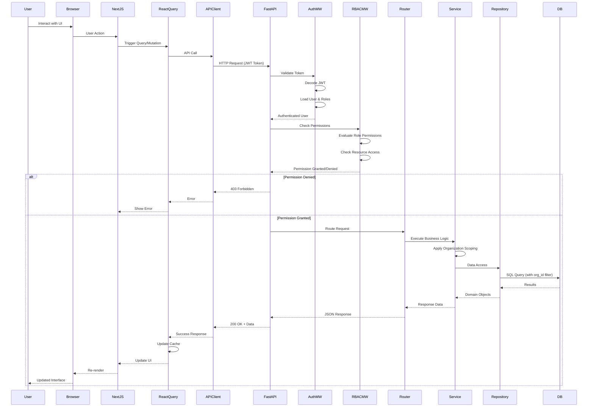
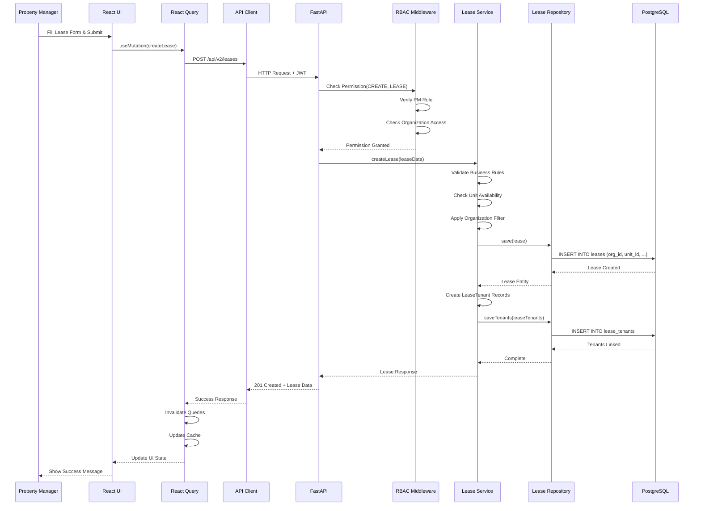

# API Flow Diagram (Request Lifecycle)

## Pinaka v2 Request Flow

```mermaid
sequenceDiagram
    participant User
    participant Browser
    participant NextJS
    participant ReactQuery
    participant APIClient
    participant FastAPI
    participant AuthMW
    participant RBACMW
    participant Router
    participant Service
    participant Repository
    participant DB
    
    User->>Browser: Interact with UI
    Browser->>NextJS: User Action
    NextJS->>ReactQuery: Trigger Query/Mutation
    ReactQuery->>APIClient: API Call
    APIClient->>FastAPI: HTTP Request (JWT Token)
    
    FastAPI->>AuthMW: Validate Token
    AuthMW->>AuthMW: Decode JWT
    AuthMW->>AuthMW: Load User & Roles
    AuthMW-->>FastAPI: Authenticated User
    
    FastAPI->>RBACMW: Check Permissions
    RBACMW->>RBACMW: Evaluate Role Permissions
    RBACMW->>RBACMW: Check Resource Access
    RBACMW-->>FastAPI: Permission Granted/Denied
    
    alt Permission Denied
        FastAPI-->>APIClient: 403 Forbidden
        APIClient-->>ReactQuery: Error
        ReactQuery-->>NextJS: Show Error
    else Permission Granted
        FastAPI->>Router: Route Request
        Router->>Service: Execute Business Logic
        Service->>Service: Apply Organization Scoping
        Service->>Repository: Data Access
        Repository->>DB: SQL Query (with org_id filter)
        DB-->>Repository: Results
        Repository-->>Service: Domain Objects
        Service-->>Router: Response Data
        Router-->>FastAPI: JSON Response
        FastAPI-->>APIClient: 200 OK + Data
        APIClient-->>ReactQuery: Success Response
        ReactQuery->>ReactQuery: Update Cache
        ReactQuery-->>NextJS: Update UI
        NextJS-->>Browser: Re-render
        Browser-->>User: Updated Interface
    end
```

## Example: Create Lease Flow

```mermaid
sequenceDiagram
    participant PM as Property Manager
    participant UI as React UI
    participant RQ as React Query
    participant API as API Client
    participant BE as FastAPI
    participant RBAC as RBAC Middleware
    participant LS as Lease Service
    participant LR as Lease Repository
    participant DB as PostgreSQL
    
    PM->>UI: Fill Lease Form & Submit
    UI->>RQ: useMutation(createLease)
    RQ->>API: POST /api/v2/leases
    API->>BE: HTTP Request + JWT
    
    BE->>RBAC: Check Permission(CREATE, LEASE)
    RBAC->>RBAC: Verify PM Role
    RBAC->>RBAC: Check Organization Access
    RBAC-->>BE: Permission Granted
    
    BE->>LS: createLease(leaseData)
    LS->>LS: Validate Business Rules
    LS->>LS: Check Unit Availability
    LS->>LS: Apply Organization Filter
    LS->>LR: save(lease)
    LR->>DB: INSERT INTO leases (org_id, unit_id, ...)
    DB-->>LR: Lease Created
    LR-->>LS: Lease Entity
    LS->>LS: Create LeaseTenant Records
    LS->>LR: saveTenants(leaseTenants)
    LR->>DB: INSERT INTO lease_tenants
    DB-->>LR: Tenants Linked
    LR-->>LS: Complete
    LS-->>BE: Lease Response
    BE-->>API: 201 Created + Lease Data
    API-->>RQ: Success Response
    RQ->>RQ: Invalidate Queries
    RQ->>RQ: Update Cache
    RQ-->>UI: Update UI State
    UI-->>PM: Show Success Message
```

