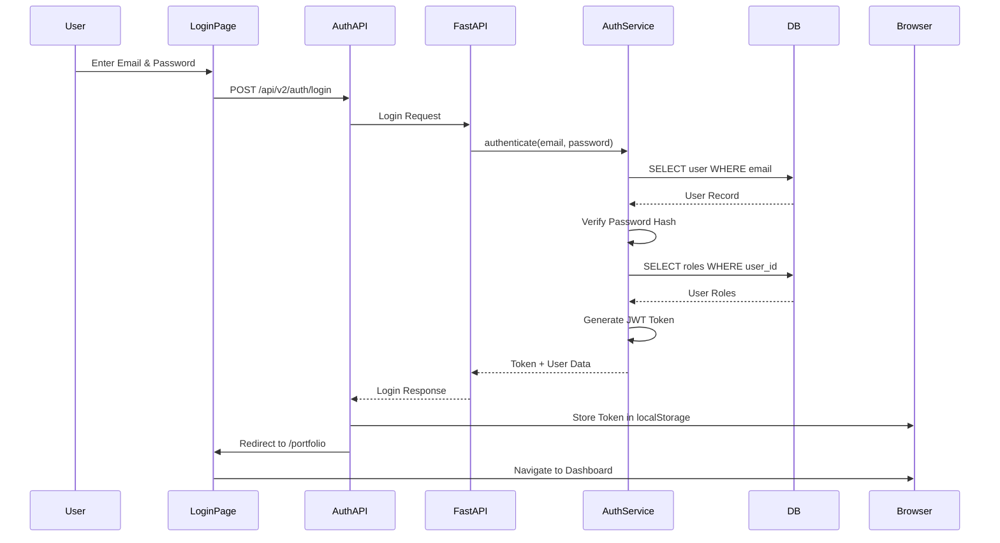
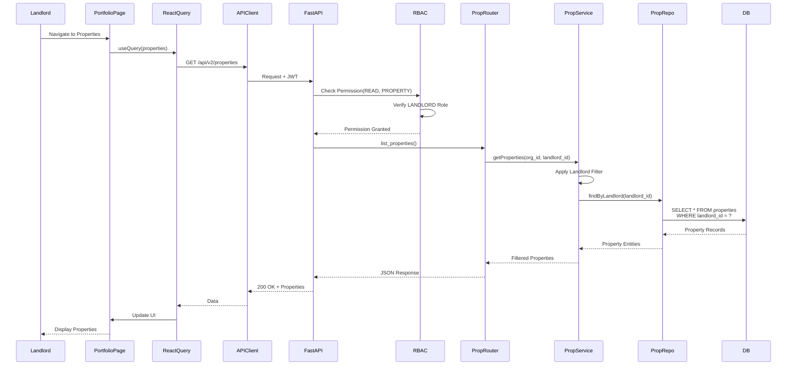
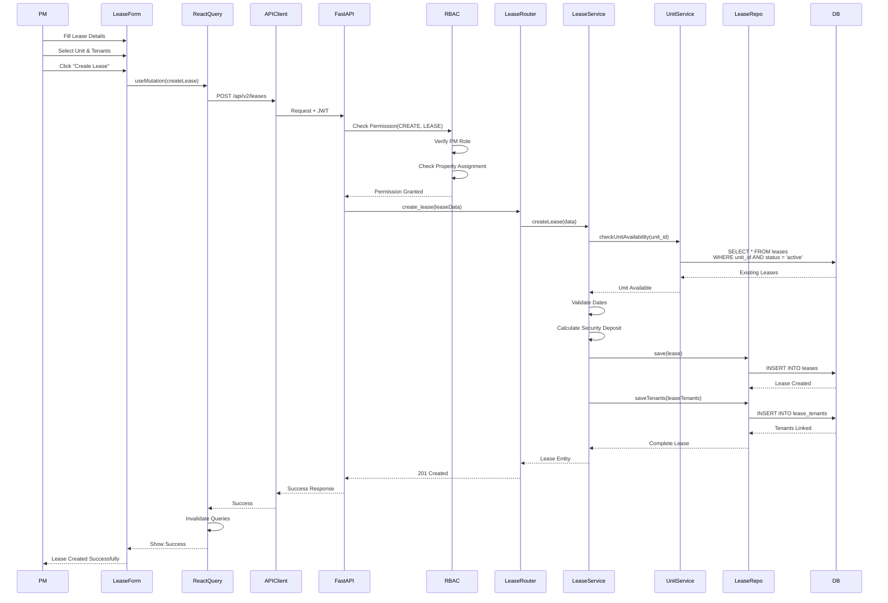
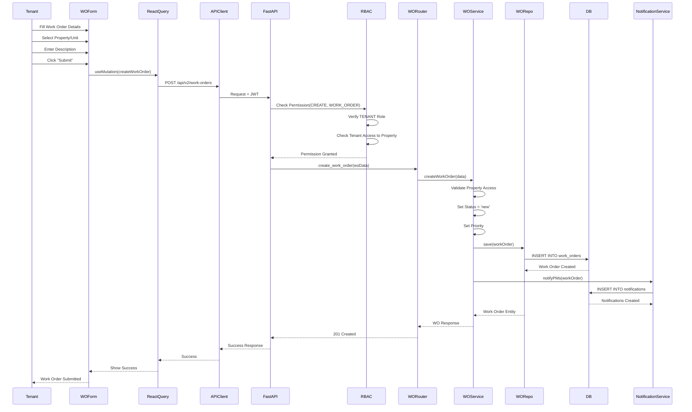
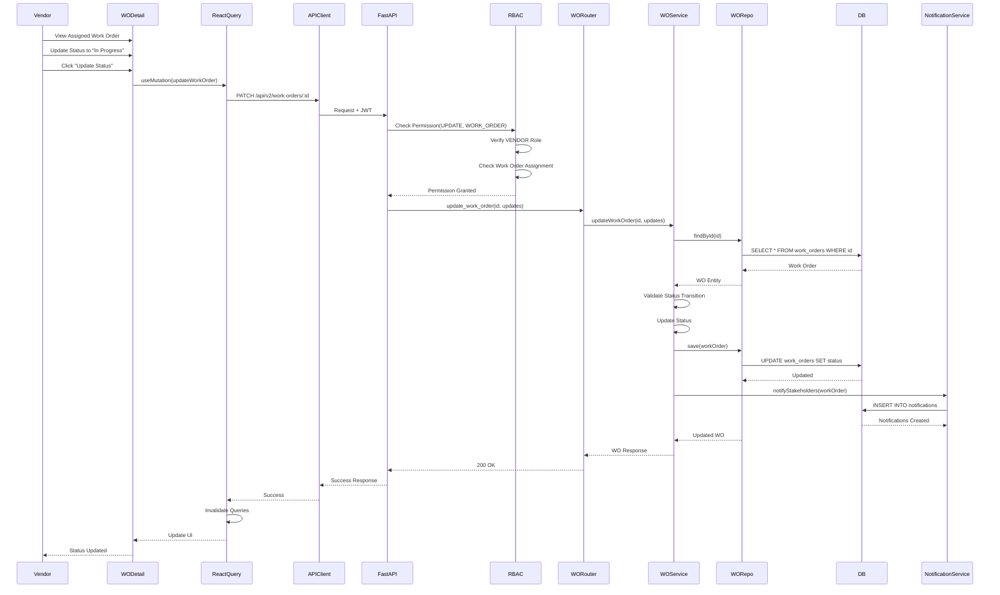
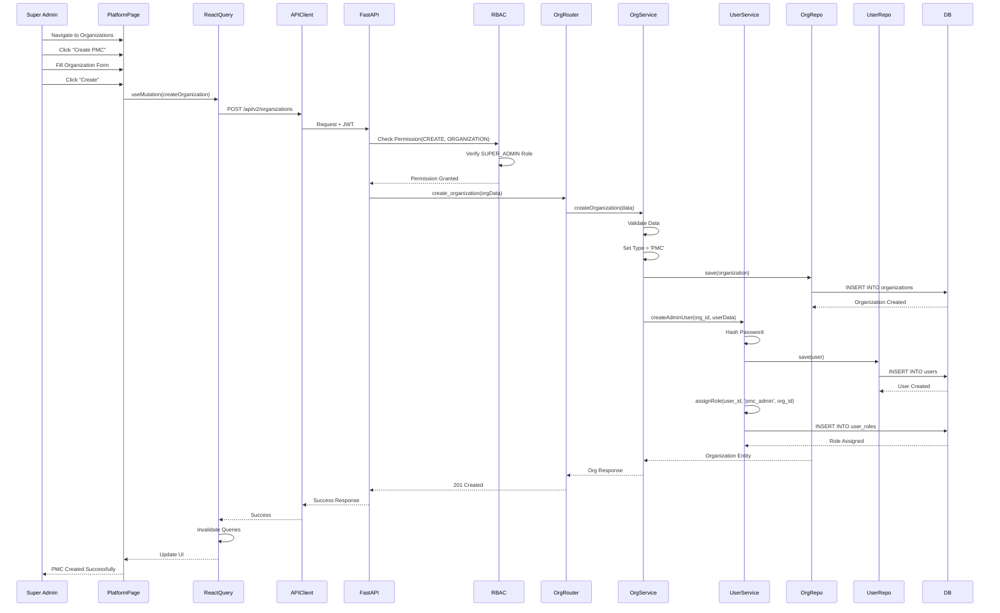

# Sequence Diagrams for Key Flows

## A) User Login Flow

## B) Landlord Viewing Properties Flow

## C) PM Creating a Lease Flow

## D) Tenant Submitting a Work Order Flow

## E) Vendor Updating Work Order Status Flow

## F) Super Admin Creating a PMC Flow

