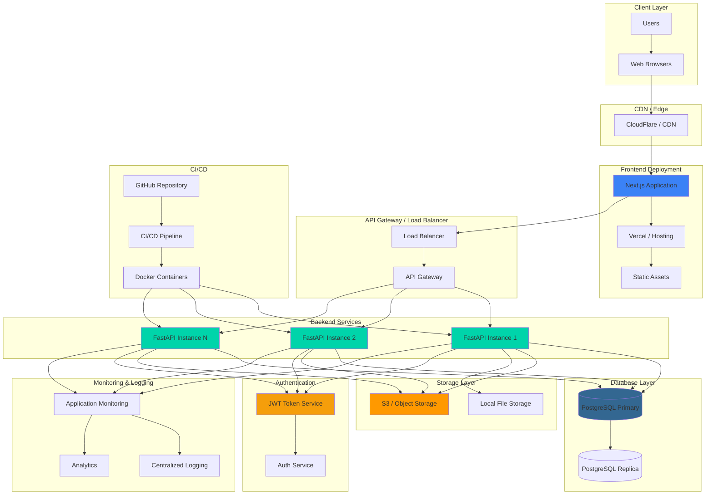
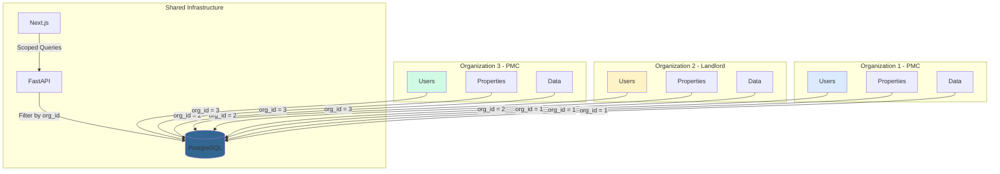
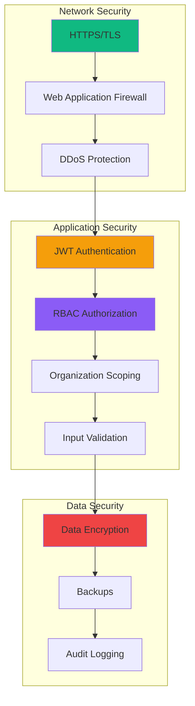

# Deployment Architecture Diagram

## Pinaka v2 Deployment Architecture

```mermaid
flowchart TB
    subgraph "Client Layer"
        Users[Users]
        Browser[Web Browsers]
    end
    
    subgraph "CDN / Edge"
        CDN[CloudFlare / CDN]
    end
    
    subgraph "Frontend Deployment"
        NextJSApp[Next.js Application]
        Vercel[Vercel / Hosting]
        StaticAssets[Static Assets]
    end
    
    subgraph "API Gateway / Load Balancer"
        LB[Load Balancer]
        API_GW[API Gateway]
    end
    
    subgraph "Backend Services"
        FastAPI1[FastAPI Instance 1]
        FastAPI2[FastAPI Instance 2]
        FastAPI3[FastAPI Instance N]
    end
    
    subgraph "Database Layer"
        PostgreSQL[(PostgreSQL Primary)]
        PostgreSQL_Replica[(PostgreSQL Replica)]
    end
    
    subgraph "Storage Layer"
        S3[S3 / Object Storage]
        LocalStorage[Local File Storage]
    end
    
    subgraph "Authentication"
        JWT[JWT Token Service]
        AuthService[Auth Service]
    end
    
    subgraph "Monitoring & Logging"
        Monitoring[Application Monitoring]
        Logging[Centralized Logging]
        Analytics[Analytics]
    end
    
    subgraph "CI/CD"
        GitHub[GitHub Repository]
        CI_CD[CI/CD Pipeline]
        Docker[Docker Containers]
    end
    
    Users --> Browser
    Browser --> CDN
    CDN --> NextJSApp
    NextJSApp --> Vercel
    Vercel --> StaticAssets
    
    NextJSApp --> LB
    LB --> API_GW
    API_GW --> FastAPI1
    API_GW --> FastAPI2
    API_GW --> FastAPI3
    
    FastAPI1 --> PostgreSQL
    FastAPI2 --> PostgreSQL
    FastAPI3 --> PostgreSQL
    PostgreSQL --> PostgreSQL_Replica
    
    FastAPI1 --> S3
    FastAPI2 --> S3
    FastAPI3 --> S3
    FastAPI1 --> LocalStorage
    
    FastAPI1 --> JWT
    FastAPI2 --> JWT
    FastAPI3 --> JWT
    JWT --> AuthService
    
    FastAPI1 --> Monitoring
    FastAPI2 --> Monitoring
    FastAPI3 --> Monitoring
    Monitoring --> Logging
    Monitoring --> Analytics
    
    GitHub --> CI_CD
    CI_CD --> Docker
    Docker --> FastAPI1
    Docker --> FastAPI2
    Docker --> FastAPI3
    
    style NextJSApp fill:#3b82f6
    style FastAPI1 fill:#00d4aa
    style FastAPI2 fill:#00d4aa
    style FastAPI3 fill:#00d4aa
    style PostgreSQL fill:#336791
    style S3 fill:#ff9900
    style JWT fill:#f59e0b
```

## Organization Boundaries

```mermaid
graph TB
    subgraph "Organization 1 - PMC"
        Org1Users[Users]
        Org1Props[Properties]
        Org1Data[Data]
    end
    
    subgraph "Organization 2 - Landlord"
        Org2Users[Users]
        Org2Props[Properties]
        Org2Data[Data]
    end
    
    subgraph "Organization 3 - PMC"
        Org3Users[Users]
        Org3Props[Properties]
        Org3Data[Data]
    end
    
    subgraph "Shared Infrastructure"
        DB[(PostgreSQL)]
        API[FastAPI]
        Frontend[Next.js]
    end
    
    Org1Users -->|org_id = 1| DB
    Org1Props -->|org_id = 1| DB
    Org1Data -->|org_id = 1| DB
    
    Org2Users -->|org_id = 2| DB
    Org2Props -->|org_id = 2| DB
    Org2Data -->|org_id = 2| DB
    
    Org3Users -->|org_id = 3| DB
    Org3Props -->|org_id = 3| DB
    Org3Data -->|org_id = 3| DB
    
    API -->|Filter by org_id| DB
    Frontend -->|Scoped Queries| API
    
    style Org1Users fill:#dbeafe
    style Org2Users fill:#fef3c7
    style Org3Users fill:#d1fae5
    style DB fill:#336791
```

## Security Layers

```mermaid
graph TB
    subgraph "Network Security"
        HTTPS[HTTPS/TLS]
        WAF[Web Application Firewall]
        DDoS[DDoS Protection]
    end
    
    subgraph "Application Security"
        JWT_Auth[JWT Authentication]
        RBAC[RBAC Authorization]
        OrgScope[Organization Scoping]
        InputValidation[Input Validation]
    end
    
    subgraph "Data Security"
        Encryption[Data Encryption]
        Backup[Backups]
        Audit[Audit Logging]
    end
    
    HTTPS --> WAF
    WAF --> DDoS
    DDoS --> JWT_Auth
    JWT_Auth --> RBAC
    RBAC --> OrgScope
    OrgScope --> InputValidation
    InputValidation --> Encryption
    Encryption --> Backup
    Backup --> Audit
    
    style HTTPS fill:#10b981
    style JWT_Auth fill:#f59e0b
    style RBAC fill:#8b5cf6
    style Encryption fill:#ef4444
```

