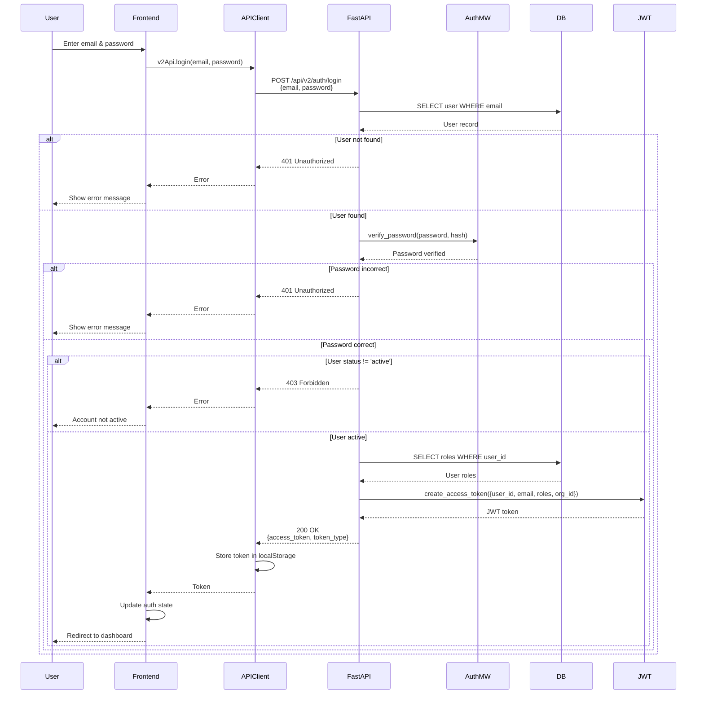

# API Sequence Diagram - POST /api/v2/auth/login

## User Login Flow

## Endpoint Details

- **Method**: POST
- **Path**: `/api/v2/auth/login`
- **Auth Required**: No
- **Request Body**: `{email: string, password: string}`
- **Response**: `{access_token: string, token_type: "bearer"}`
- **Dependencies**: None (public endpoint)

