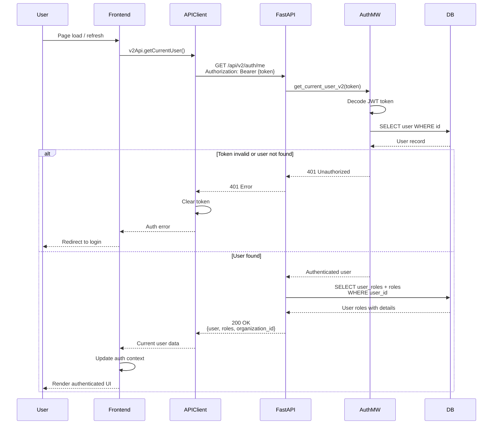

# API Sequence Diagram - GET /api/v2/auth/me

## Get Current User Flow

## Endpoint Details

- **Method**: GET
- **Path**: `/api/v2/auth/me`
- **Auth Required**: Yes (JWT token)
- **Response**: `{user: User, roles: Role[], organization_id: UUID}`
- **Dependencies**: `get_current_user_v2` (auth middleware)

