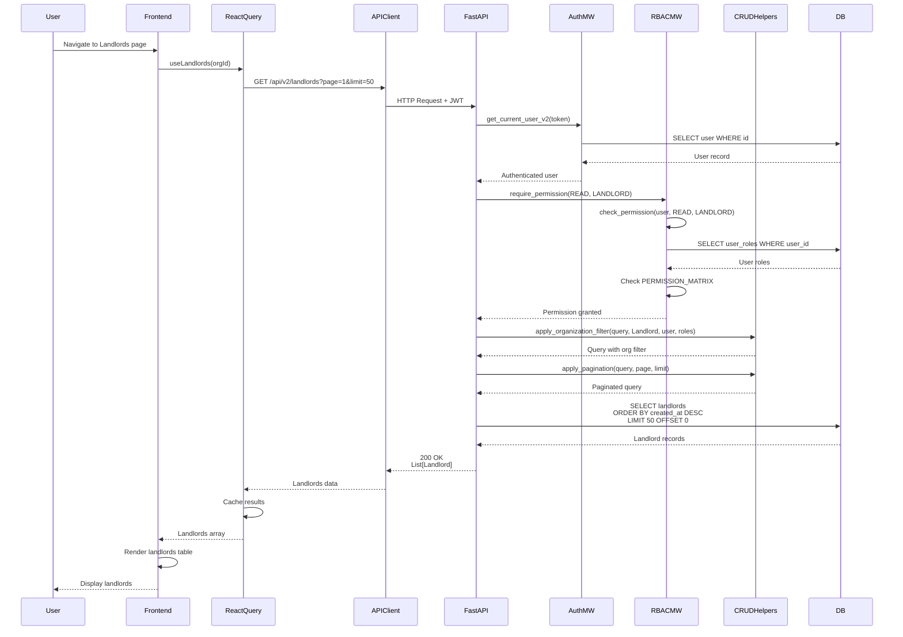

# API Sequence Diagram - GET /api/v2/landlords

## List Landlords Flow

## Endpoint Details

- **Method**: GET
- **Path**: `/api/v2/landlords`
- **Query Params**: `organization_id?`, `page=1`, `limit=50`
- **Auth Required**: Yes
- **RBAC**: `require_permission(READ, LANDLORD)`
- **Response**: `List[Landlord]`

