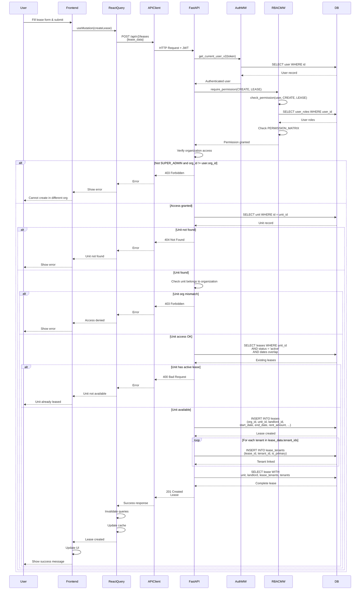

# API Sequence Diagram - POST /api/v2/leases

## Create Lease Flow

## Endpoint Details

- **Method**: POST
- **Path**: `/api/v2/leases`
- **Auth Required**: Yes
- **RBAC**: `require_permission(CREATE, LEASE)`
- **Request Body**: `LeaseCreate` (with tenant_ids array)
- **Response**: `Lease` (201 Created)
- **Business Logic**:
  - Verify unit exists and belongs to organization
  - Check unit availability (no overlapping active leases)
  - Create lease record
  - Create lease_tenant records for all tenants
- **Dependencies**:
  - `get_current_user_v2` (auth)
  - `require_permission` (RBAC)
  - Organization scoping check

