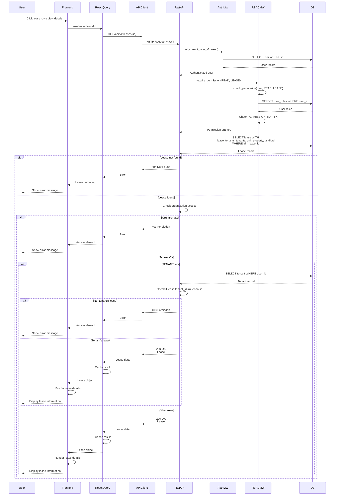

# API Sequence Diagram - GET /api/v2/leases/{lease_id}

## Get Lease by ID Flow

## Endpoint Details

- **Method**: GET
- **Path**: `/api/v2/leases/{lease_id}`
- **Auth Required**: Yes
- **RBAC**: `require_permission(READ, LEASE)`
- **Response**: `Lease` (with all relationships)
- **Special Logic**:
  - Tenants can only see their own leases
  - Organization access is checked

