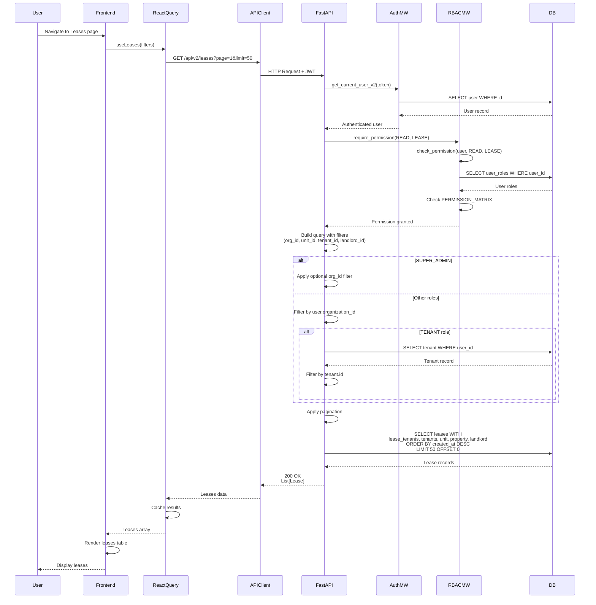

# API Sequence Diagram - GET /api/v2/leases

## List Leases Flow

## Endpoint Details

- **Method**: GET
- **Path**: `/api/v2/leases`
- **Query Params**: `organization_id?`, `unit_id?`, `tenant_id?`, `landlord_id?`, `page=1`, `limit=50`
- **Auth Required**: Yes
- **RBAC**: `require_permission(READ, LEASE)`
- **Response**: `List[Lease]` (with eager-loaded relationships)
- **Special Logic**:
  - Tenants see only their own leases
  - Non-super users see only their organization's leases
  - Supports multiple filter parameters

