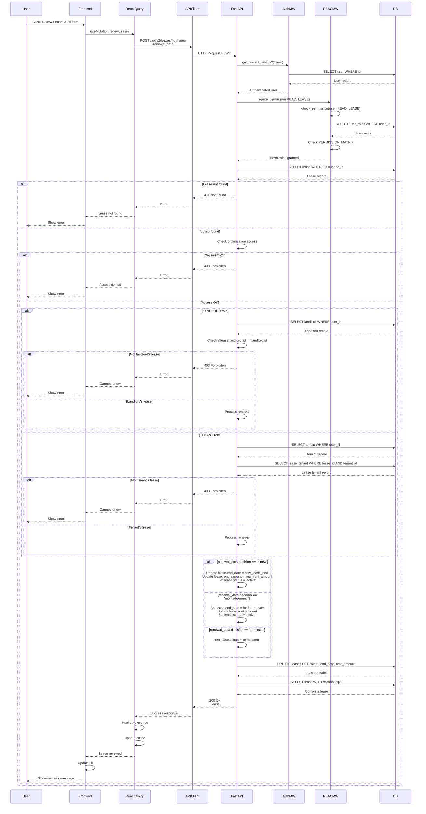

# API Sequence Diagram - POST /api/v2/leases/{lease_id}/renew

## Renew Lease Flow

## Endpoint Details

- **Method**: POST
- **Path**: `/api/v2/leases/{lease_id}/renew`
- **Auth Required**: Yes
- **RBAC**: `require_permission(READ, LEASE)`
- **Request Body**: `LeaseRenewalRequest`
- **Response**: `Lease` (200 OK)
- **Business Logic**:
  - Landlords can only renew leases for their properties
  - Tenants can only renew their own leases
  - Supports three decisions: "renew", "month-to-month", "terminate"

