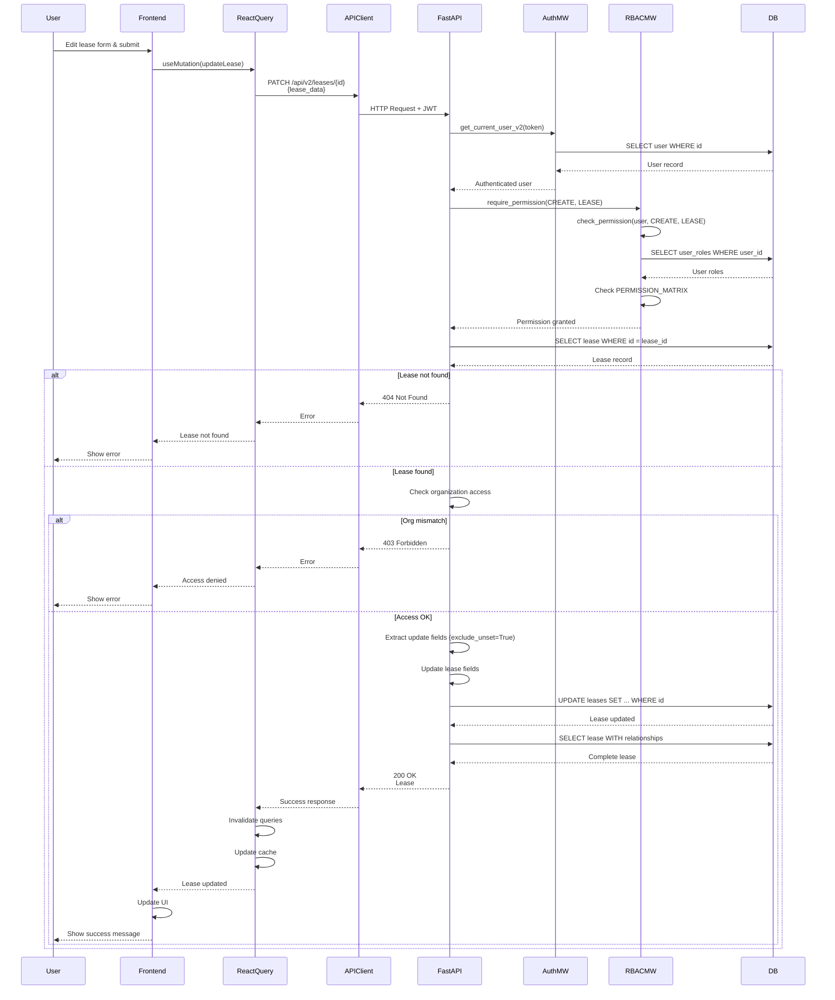

# API Sequence Diagram - PATCH /api/v2/leases/{lease_id}

## Update Lease Flow

## Endpoint Details

- **Method**: PATCH
- **Path**: `/api/v2/leases/{lease_id}`
- **Auth Required**: Yes
- **RBAC**: `require_permission(CREATE, LEASE)`
- **Request Body**: `LeaseUpdate` (all fields optional)
- **Response**: `Lease` (200 OK)

