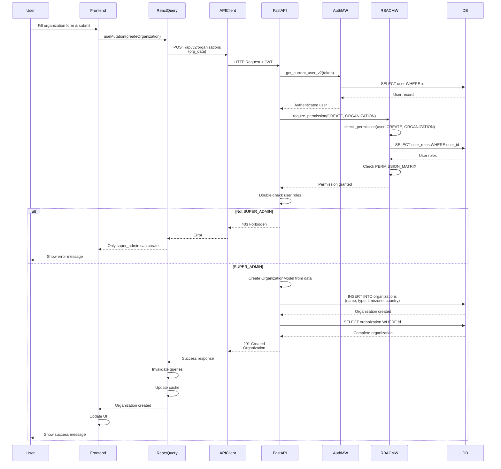

# API Sequence Diagram - POST /api/v2/organizations

## Create Organization Flow

## Endpoint Details

- **Method**: POST
- **Path**: `/api/v2/organizations`
- **Auth Required**: Yes
- **RBAC**: `require_permission(CREATE, ORGANIZATION)`
- **Required Role**: `SUPER_ADMIN` only
- **Request Body**: `OrganizationCreate`
- **Response**: `Organization` (201 Created)

