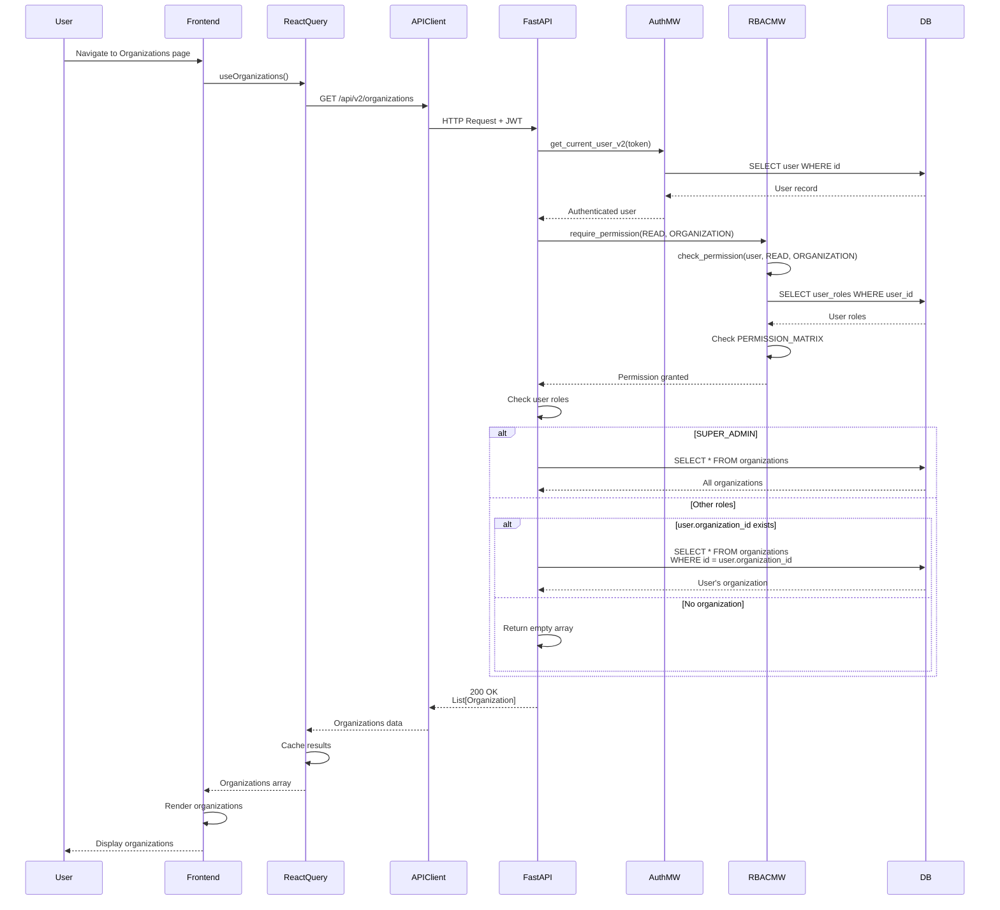

# API Sequence Diagram - GET /api/v2/organizations

## List Organizations Flow

## Endpoint Details

- **Method**: GET
- **Path**: `/api/v2/organizations`
- **Auth Required**: Yes
- **RBAC**: `require_permission(READ, ORGANIZATION)`
- **Response**: `List[Organization]`
- **Special Logic**:
  - SUPER_ADMIN sees all organizations
  - Other users see only their own organization (or empty array)

