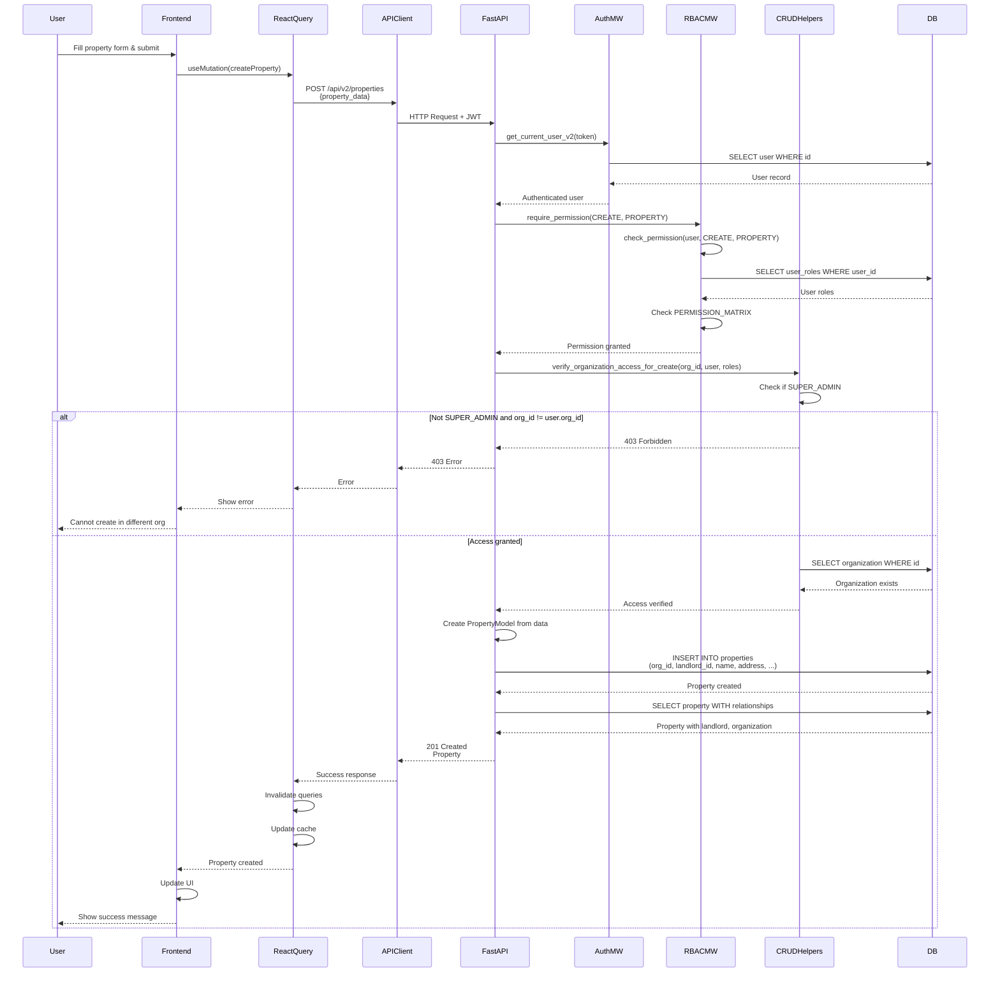

# API Sequence Diagram - POST /api/v2/properties

## Create Property Flow

## Endpoint Details

- **Method**: POST
- **Path**: `/api/v2/properties`
- **Auth Required**: Yes
- **RBAC**: `require_permission(CREATE, PROPERTY)`
- **Request Body**: `PropertyCreate` schema
- **Response**: `Property` (201 Created)
- **Dependencies**:
  - `get_current_user_v2` (auth)
  - `require_permission` (RBAC)
  - `verify_organization_access_for_create` (org scoping)

