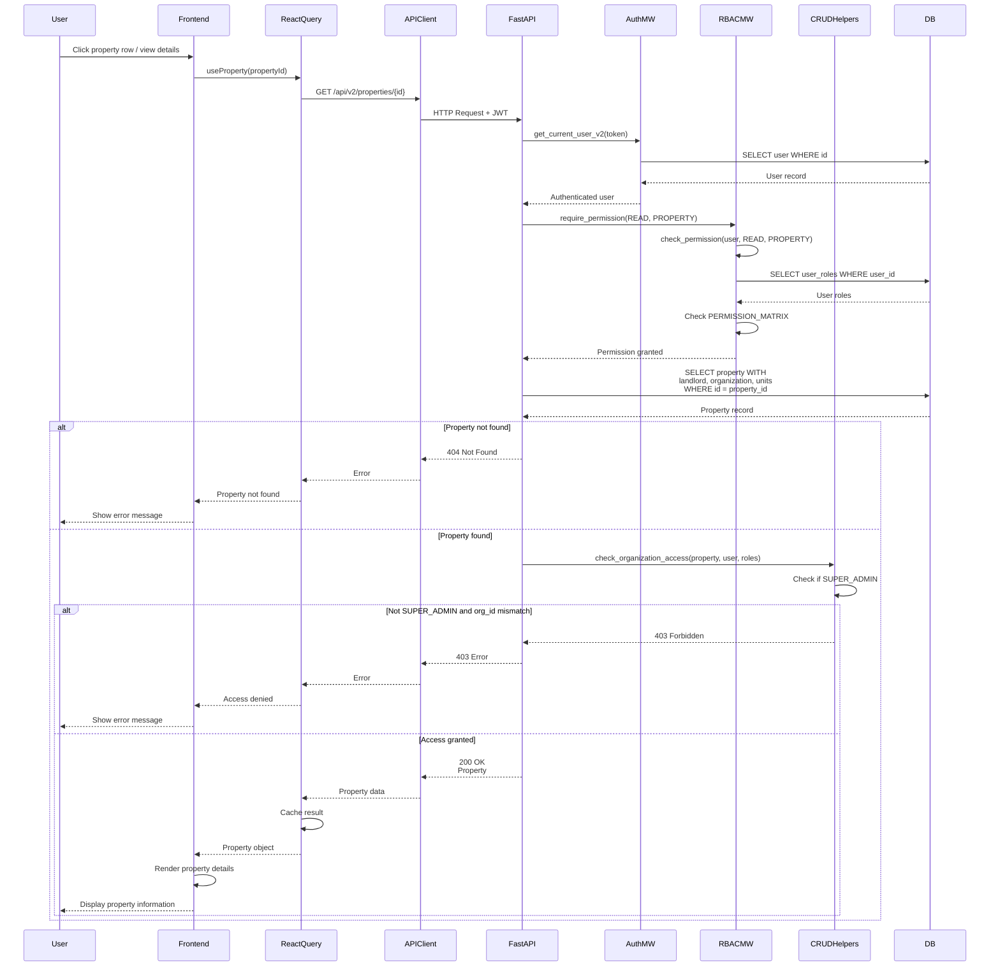

# API Sequence Diagram - GET /api/v2/properties/{property_id}

## Get Property by ID Flow

## Endpoint Details

- **Method**: GET
- **Path**: `/api/v2/properties/{property_id}`
- **Auth Required**: Yes
- **RBAC**: `require_permission(READ, PROPERTY)`
- **Response**: `Property` (with landlord, organization, units)
- **Dependencies**:
  - `get_current_user_v2` (auth)
  - `require_permission` (RBAC)
  - `check_organization_access` (org scoping)

