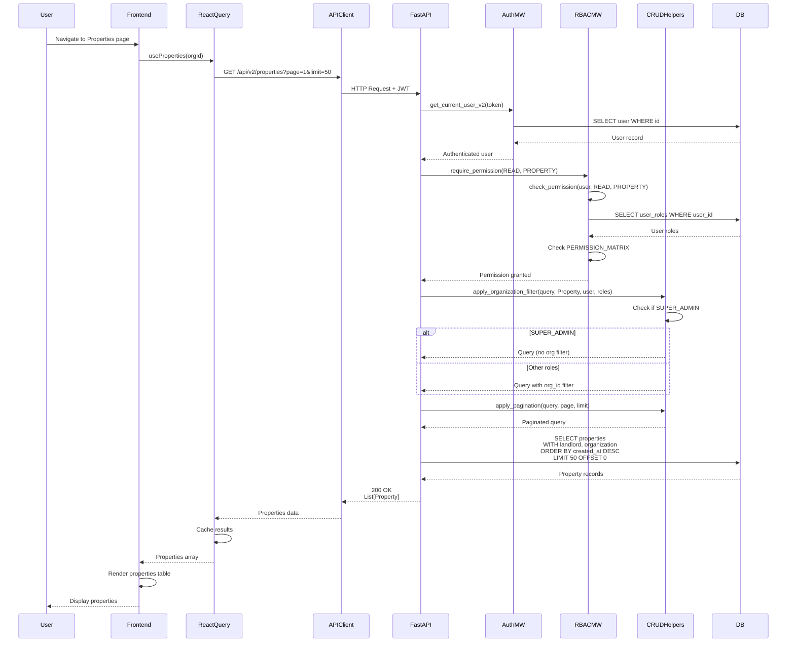

# API Sequence Diagram - GET /api/v2/properties

## List Properties Flow

## Endpoint Details

- **Method**: GET
- **Path**: `/api/v2/properties`
- **Query Params**: `organization_id?`, `page=1`, `limit=50`
- **Auth Required**: Yes
- **RBAC**: `require_permission(READ, PROPERTY)`
- **Response**: `List[Property]`
- **Dependencies**: 
  - `get_current_user_v2` (auth)
  - `require_permission` (RBAC)
  - `apply_organization_filter` (org scoping)
  - `apply_pagination` (pagination)

