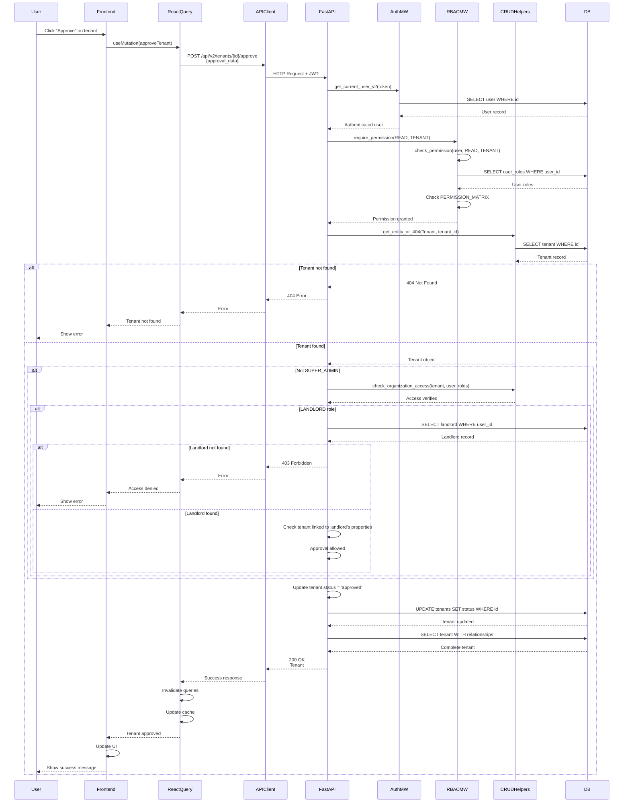

# API Sequence Diagram - POST /api/v2/tenants/{tenant_id}/approve

## Approve Tenant Flow

## Endpoint Details

- **Method**: POST
- **Path**: `/api/v2/tenants/{tenant_id}/approve`
- **Auth Required**: Yes
- **RBAC**: `require_permission(READ, TENANT)`
- **Request Body**: `TenantApprovalRequest` (empty object)
- **Response**: `Tenant` (200 OK)
- **Business Logic**:
  - Landlords can only approve tenants for their properties
  - Updates tenant status to 'approved'

