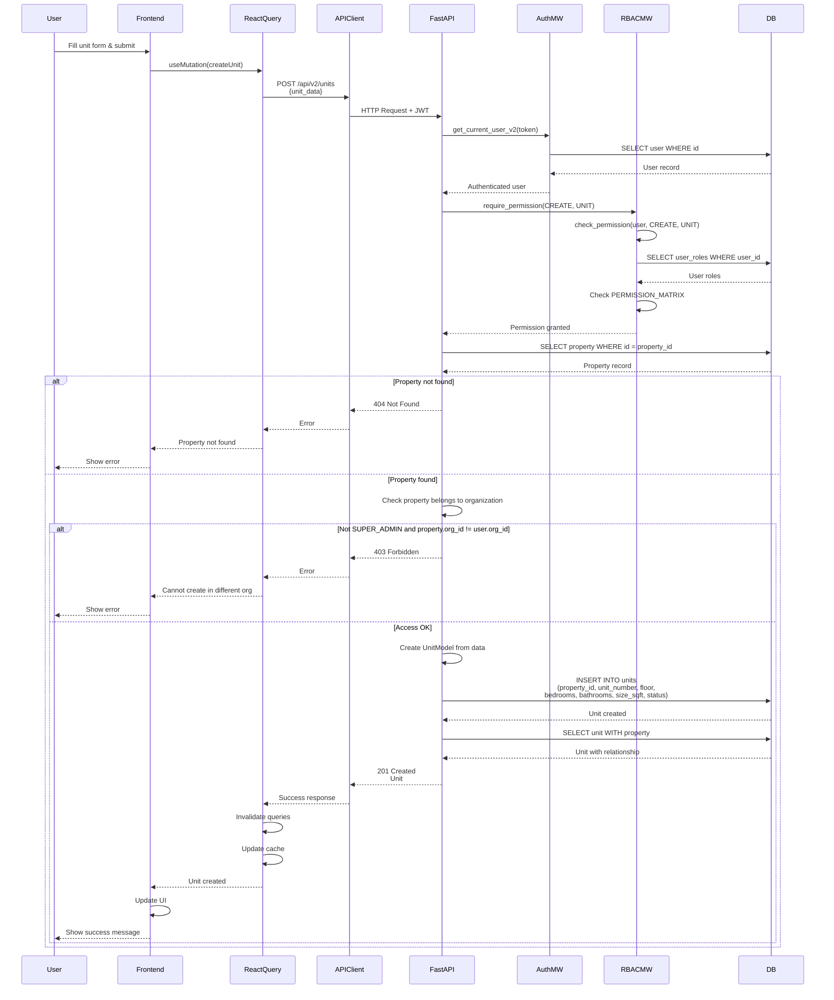

# API Sequence Diagram - POST /api/v2/units

## Create Unit Flow

## Endpoint Details

- **Method**: POST
- **Path**: `/api/v2/units`
- **Auth Required**: Yes
- **RBAC**: `require_permission(CREATE, UNIT)`
- **Request Body**: `UnitCreate`
- **Response**: `Unit` (201 Created)
- **Business Logic**:
  - Verifies property exists
  - Checks property belongs to user's organization

