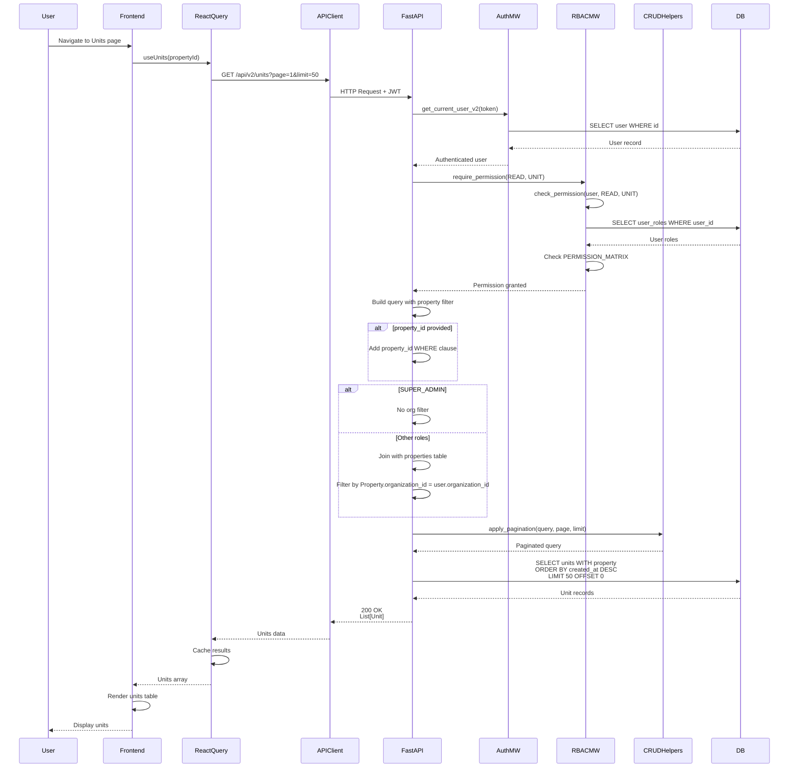

# API Sequence Diagram - GET /api/v2/units

## List Units Flow

## Endpoint Details

- **Method**: GET
- **Path**: `/api/v2/units`
- **Query Params**: `property_id?`, `page=1`, `limit=50`
- **Auth Required**: Yes
- **RBAC**: `require_permission(READ, UNIT)`
- **Response**: `List[Unit]`
- **Special Logic**:
  - Units are filtered by organization through their parent property
  - Supports optional property filter

