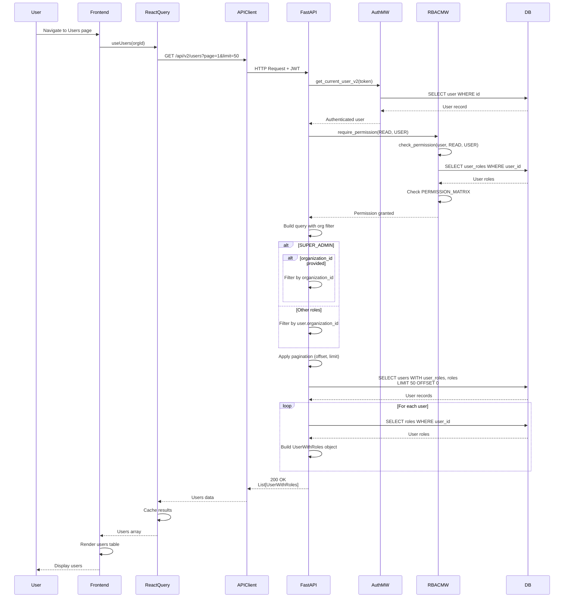

# API Sequence Diagram - GET /api/v2/users

## List Users Flow

## Endpoint Details

- **Method**: GET
- **Path**: `/api/v2/users`
- **Query Params**: `organization_id?`, `page=1`, `limit=50`
- **Auth Required**: Yes
- **RBAC**: `require_permission(READ, USER)`
- **Response**: `List[UserWithRoles]`
- **Note**: Roles are loaded separately for each user

