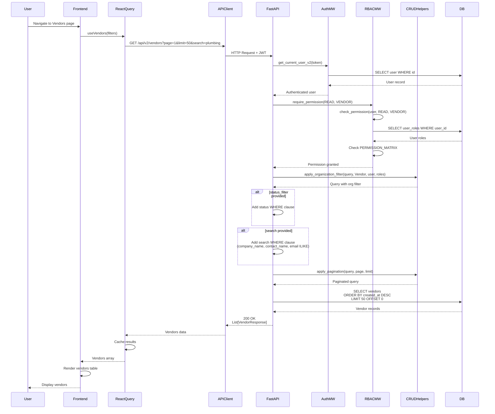

# API Sequence Diagram - GET /api/v2/vendors

## List Vendors Flow

## Endpoint Details

- **Method**: GET
- **Path**: `/api/v2/vendors`
- **Query Params**: `organization_id?`, `search?`, `status_filter?`, `page=1`, `limit=50`
- **Auth Required**: Yes
- **RBAC**: `require_permission(READ, VENDOR)`
- **Response**: `List[VendorResponse]`
- **Special Features**:
  - Supports text search across company_name, contact_name, and email
  - Supports status filtering

