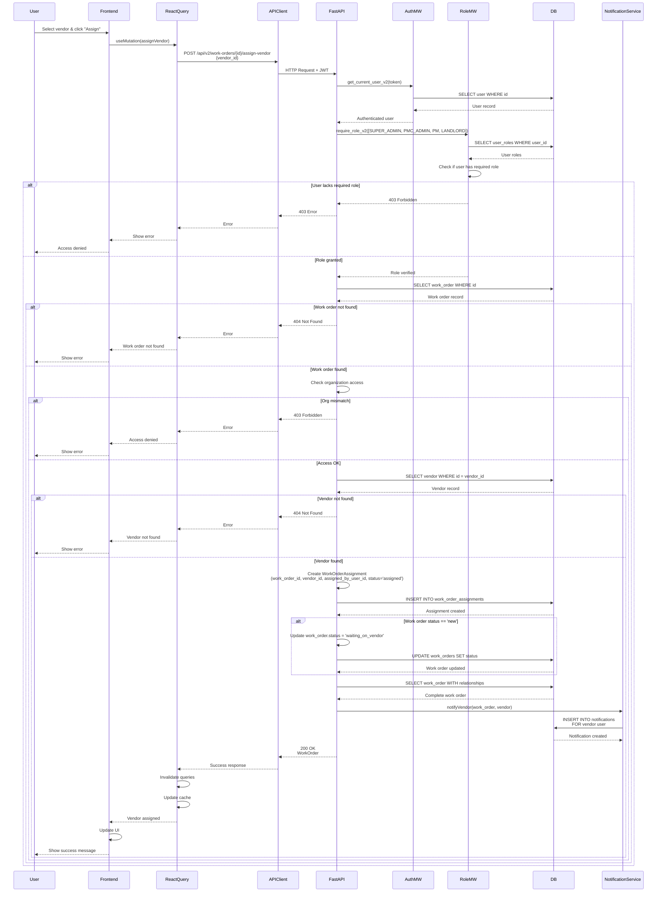

# API Sequence Diagram - POST /api/v2/work-orders/{work_order_id}/assign-vendor

## Assign Vendor to Work Order Flow

## Endpoint Details

- **Method**: POST
- **Path**: `/api/v2/work-orders/{work_order_id}/assign-vendor`
- **Auth Required**: Yes
- **Role Required**: `SUPER_ADMIN`, `PMC_ADMIN`, `PM`, or `LANDLORD`
- **Request Body**: `WorkOrderAssignVendorRequest` (with vendor_id)
- **Response**: `WorkOrder` (200 OK)
- **Business Logic**:
  - Verify user has required role
  - Verify work order exists and user has access
  - Verify vendor exists
  - Create work_order_assignment record
  - If work order status is 'new', update to 'waiting_on_vendor'
  - Notify vendor of assignment
- **Dependencies**:
  - `get_current_user_v2` (auth)
  - `require_role_v2` (role check)
  - Organization scoping check

