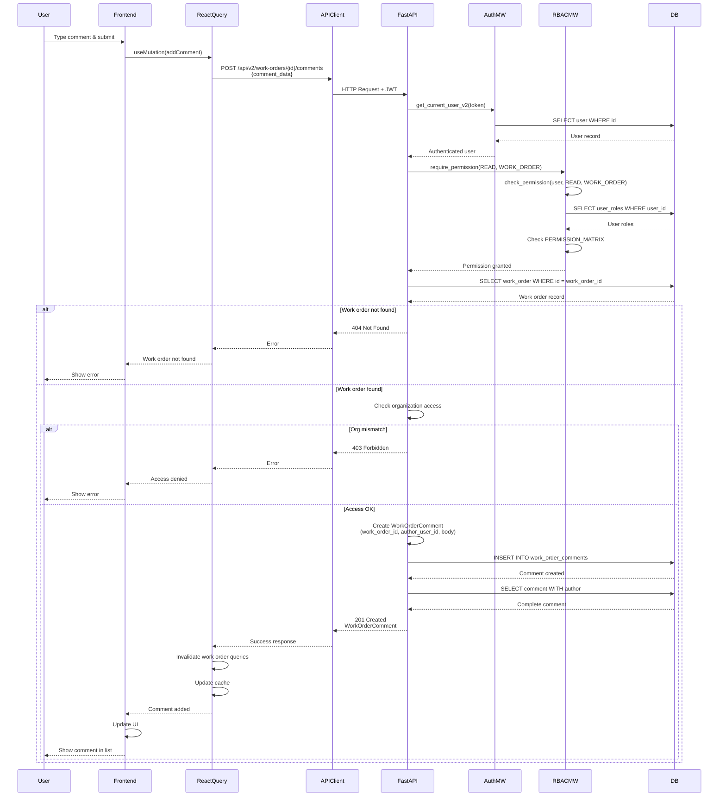

# API Sequence Diagram - POST /api/v2/work-orders/{work_order_id}/comments

## Add Work Order Comment Flow

## Endpoint Details

- **Method**: POST
- **Path**: `/api/v2/work-orders/{work_order_id}/comments`
- **Auth Required**: Yes
- **RBAC**: `require_permission(READ, WORK_ORDER)`
- **Request Body**: `WorkOrderCommentCreate` (body: string)
- **Response**: `WorkOrderComment` (201 Created)
- **Note**: Any user with READ permission on the work order can add comments

