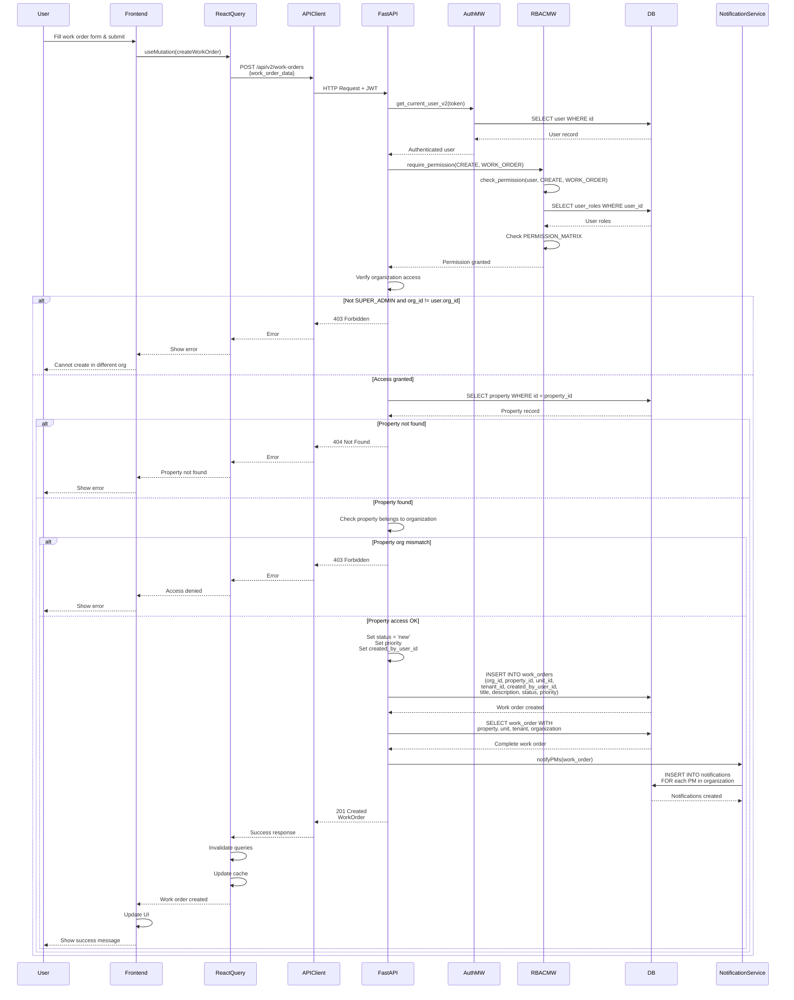

# API Sequence Diagram - POST /api/v2/work-orders

## Create Work Order Flow

## Endpoint Details

- **Method**: POST
- **Path**: `/api/v2/work-orders`
- **Auth Required**: Yes
- **RBAC**: `require_permission(CREATE, WORK_ORDER)`
- **Request Body**: `WorkOrderCreate`
- **Response**: `WorkOrder` (201 Created)
- **Business Logic**:
  - Verify property exists and belongs to organization
  - Set default status = 'new'
  - Set default priority if not provided
  - Create work order record
  - Notify property managers
- **Dependencies**:
  - `get_current_user_v2` (auth)
  - `require_permission` (RBAC)
  - Organization scoping check

