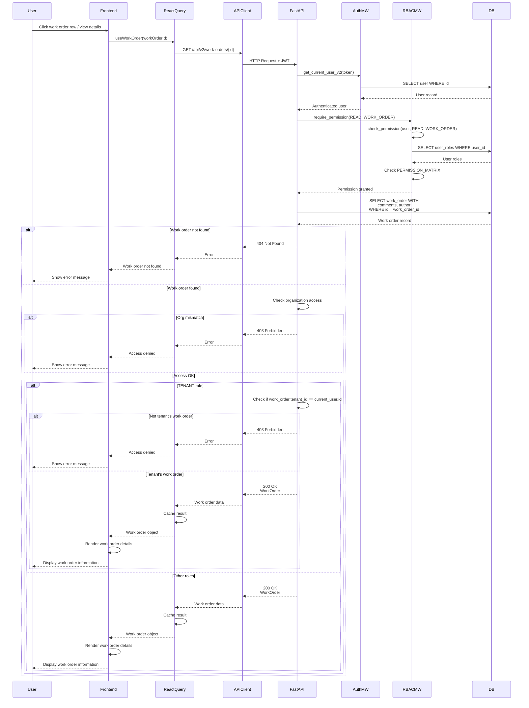

# API Sequence Diagram - GET /api/v2/work-orders/{work_order_id}

## Get Work Order by ID Flow

## Endpoint Details

- **Method**: GET
- **Path**: `/api/v2/work-orders/{work_order_id}`
- **Auth Required**: Yes
- **RBAC**: `require_permission(READ, WORK_ORDER)`
- **Response**: `WorkOrder` (with comments and author)
- **Special Logic**:
  - Tenants can only see their own work orders
  - Organization access is checked

