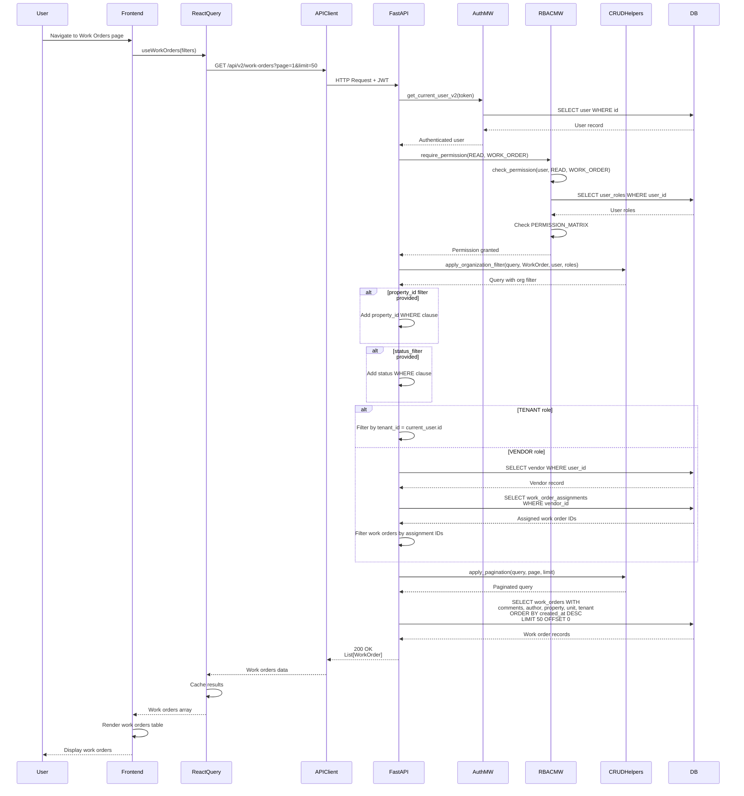

# API Sequence Diagram - GET /api/v2/work-orders

## List Work Orders Flow

## Endpoint Details

- **Method**: GET
- **Path**: `/api/v2/work-orders`
- **Query Params**: `organization_id?`, `property_id?`, `status_filter?`, `page=1`, `limit=50`
- **Auth Required**: Yes
- **RBAC**: `require_permission(READ, WORK_ORDER)`
- **Response**: `List[WorkOrder]`
- **Role-Based Filtering**:
  - **TENANT**: Only their own work orders
  - **VENDOR**: Only assigned work orders (via work_order_assignments)
  - **Others**: Organization-scoped work orders
- **Dependencies**:
  - `get_current_user_v2` (auth)
  - `require_permission` (RBAC)
  - `apply_organization_filter` (org scoping)
  - `apply_pagination` (pagination)

