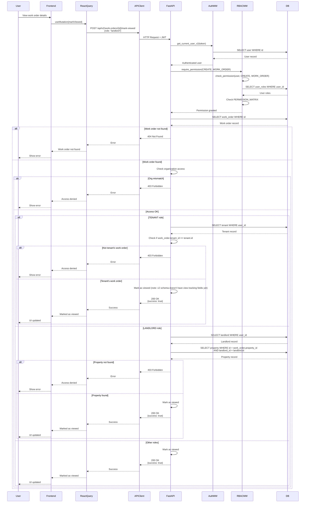

# API Sequence Diagram - POST /api/v2/work-orders/{work_order_id}/mark-viewed

## Mark Work Order as Viewed Flow

## Endpoint Details

- **Method**: POST
- **Path**: `/api/v2/work-orders/{work_order_id}/mark-viewed`
- **Auth Required**: Yes
- **RBAC**: `require_permission(CREATE, WORK_ORDER)`
- **Request Body**: `WorkOrderMarkViewedRequest` (role: "landlord" | "tenant")
- **Response**: `{success: true, message: "Work order marked as viewed"}` (200 OK)
- **Note**: View tracking fields may need to be added to the v2 schema

