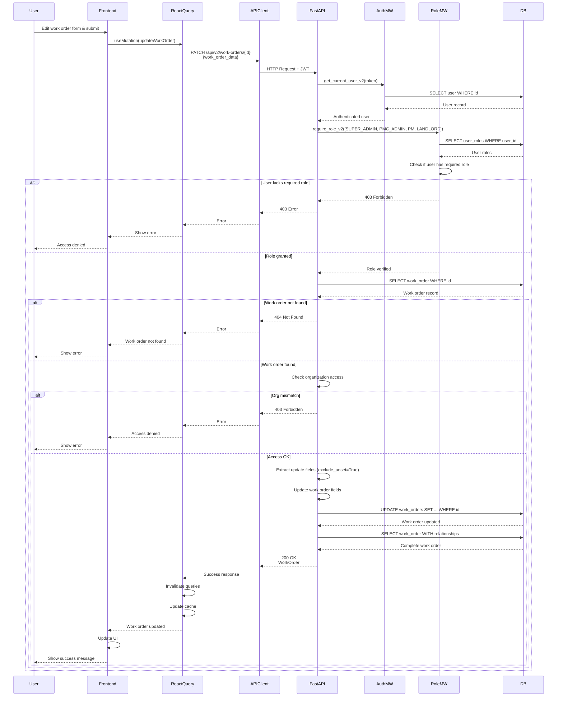

# API Sequence Diagram - PATCH /api/v2/work-orders/{work_order_id}

## Update Work Order Flow

## Endpoint Details

- **Method**: PATCH
- **Path**: `/api/v2/work-orders/{work_order_id}`
- **Auth Required**: Yes
- **Role Required**: `SUPER_ADMIN`, `PMC_ADMIN`, `PM`, or `LANDLORD`
- **Request Body**: `WorkOrderUpdate` (all fields optional)
- **Response**: `WorkOrder` (200 OK)

