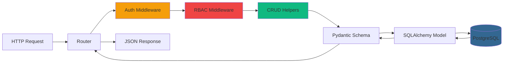
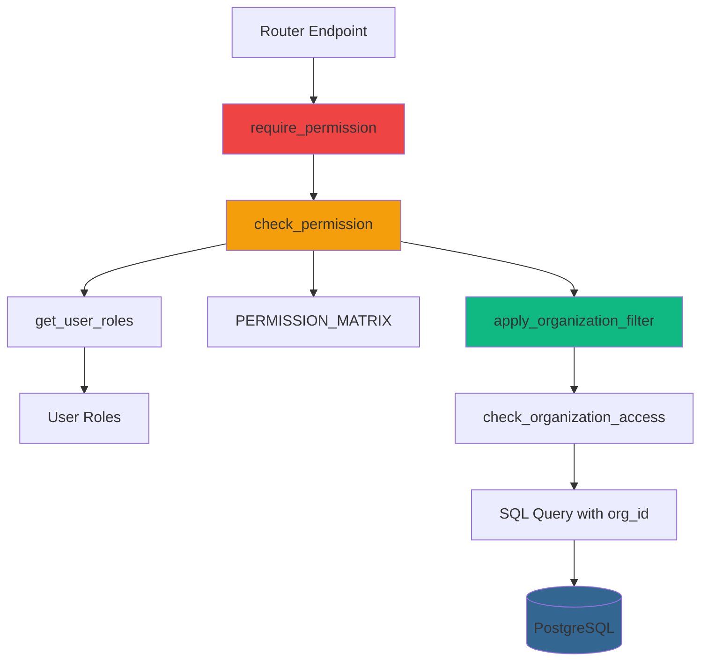
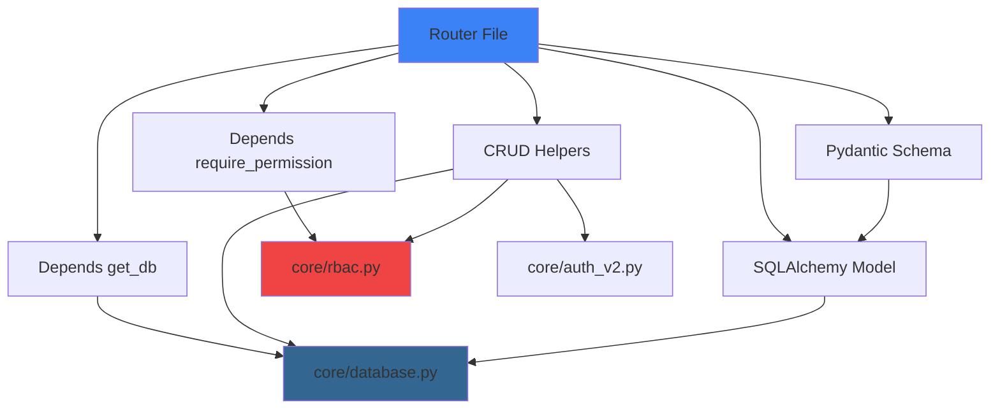

# Backend Dependency Graph

## Pinaka v2 Backend Dependencies

This diagram shows the complete dependency structure of the FastAPI backend, including routers, services, repositories, models, and cross-cutting concerns.

```mermaid
graph TB
    subgraph "FastAPI Application"
        Main[main.py]
        App[FastAPI App]
    end
    
    subgraph "API Routers Layer"
        AuthRouter[auth_v2.py]
        OrgRouter[organizations.py]
        PropRouter[properties.py]
        UnitRouter[units.py]
        LeaseRouter[leases.py]
        TenantRouter[tenants.py]
        LandlordRouter[landlords.py]
        VendorRouter[vendors_v2.py]
        WORouter[work_orders.py]
        AttachRouter[attachments.py]
        NotifRouter[notifications.py]
        AuditRouter[audit_logs.py]
        UserRouter[users.py]
        SearchRouter[search.py]
        TaskRouter[tasks.py]
        ConvRouter[conversations.py]
        InvRouter[invitations.py]
        FormRouter[forms.py]
        RentRouter[rent_payments.py]
        ExpRouter[expenses.py]
        InspRouter[inspections.py]
        RBACRouter[rbac.py]
        OnboardRouter[onboarding.py]
    end
    
    subgraph "Core Middleware Layer"
        AuthMW[core/auth_v2.py<br/>get_current_user_v2<br/>get_user_roles]
        RBACMW[core/rbac.py<br/>require_permission<br/>check_permission<br/>PERMISSION_MATRIX]
        CRUDHelpers[core/crud_helpers.py<br/>apply_organization_filter<br/>check_organization_access<br/>apply_pagination]
        Database[core/database.py<br/>get_db<br/>engine<br/>Base]
        Config[core/config.py<br/>settings]
        Exceptions[core/exceptions.py<br/>setup_exception_handlers]
    end
    
    subgraph "Schemas Layer"
        PropSchema[schemas/property.py]
        UnitSchema[schemas/unit.py]
        LeaseSchema[schemas/lease.py]
        TenantSchema[schemas/tenant.py]
        LandlordSchema[schemas/landlord.py]
        VendorSchema[schemas/vendor_v2.py]
        WOSchema[schemas/work_order.py]
        UserSchema[schemas/user.py]
        OrgSchema[schemas/organization.py]
        AuthSchema[schemas/auth.py]
        OtherSchemas[schemas/*.py<br/>Other 15+ schemas]
    end
    
    subgraph "Models Layer"
        Models[db/models_v2.py]
        OrgModel[Organization Model]
        UserModel[User Model]
        RoleModel[Role Model]
        UserRoleModel[UserRole Model]
        PropModel[Property Model]
        UnitModel[Unit Model]
        LeaseModel[Lease Model]
        TenantModel[Tenant Model]
        LandlordModel[Landlord Model]
        VendorModel[Vendor Model]
        WOModel[WorkOrder Model]
        OtherModels[25+ Other Models]
    end
    
    subgraph "Services Layer"
        VendorService[services/vendor_service.py]
        FutureServices[services/*.py<br/>Future domain services]
    end
    
    subgraph "Database"
        PostgreSQL[(PostgreSQL v2)]
    end
    
    %% Main app connections
    Main --> App
    App --> AuthRouter
    App --> OrgRouter
    App --> PropRouter
    App --> UnitRouter
    App --> LeaseRouter
    App --> TenantRouter
    App --> LandlordRouter
    App --> VendorRouter
    App --> WORouter
    App --> AttachRouter
    App --> NotifRouter
    App --> AuditRouter
    App --> UserRouter
    App --> SearchRouter
    App --> TaskRouter
    App --> ConvRouter
    App --> InvRouter
    App --> FormRouter
    App --> RentRouter
    App --> ExpRouter
    App --> InspRouter
    App --> RBACRouter
    App --> OnboardRouter
    App --> Exceptions
    
    %% Router dependencies
    AuthRouter --> AuthMW
    AuthRouter --> AuthSchema
    AuthRouter --> UserModel
    AuthRouter --> Database
    
    OrgRouter --> AuthMW
    OrgRouter --> RBACMW
    OrgRouter --> OrgSchema
    OrgRouter --> OrgModel
    OrgRouter --> CRUDHelpers
    OrgRouter --> Database
    
    PropRouter --> AuthMW
    PropRouter --> RBACMW
    PropRouter --> PropSchema
    PropRouter --> PropModel
    PropRouter --> CRUDHelpers
    PropRouter --> Database
    
    UnitRouter --> AuthMW
    UnitRouter --> RBACMW
    UnitRouter --> UnitSchema
    UnitRouter --> UnitModel
    UnitRouter --> CRUDHelpers
    UnitRouter --> Database
    
    LeaseRouter --> AuthMW
    LeaseRouter --> RBACMW
    LeaseRouter --> LeaseSchema
    LeaseRouter --> LeaseModel
    LeaseRouter --> CRUDHelpers
    LeaseRouter --> Database
    
    TenantRouter --> AuthMW
    TenantRouter --> RBACMW
    TenantRouter --> TenantSchema
    TenantRouter --> TenantModel
    TenantRouter --> CRUDHelpers
    TenantRouter --> Database
    
    LandlordRouter --> AuthMW
    LandlordRouter --> RBACMW
    LandlordRouter --> LandlordSchema
    LandlordRouter --> LandlordModel
    LandlordRouter --> CRUDHelpers
    LandlordRouter --> Database
    
    VendorRouter --> AuthMW
    VendorRouter --> RBACMW
    VendorRouter --> VendorSchema
    VendorRouter --> VendorModel
    VendorRouter --> VendorService
    VendorRouter --> CRUDHelpers
    VendorRouter --> Database
    
    WORouter --> AuthMW
    WORouter --> RBACMW
    WORouter --> WOSchema
    WORouter --> WOModel
    WORouter --> CRUDHelpers
    WORouter --> Database
    
    UserRouter --> AuthMW
    UserRouter --> RBACMW
    UserRouter --> UserSchema
    UserRouter --> UserModel
    UserRouter --> RoleModel
    UserRouter --> UserRoleModel
    UserRouter --> CRUDHelpers
    UserRouter --> Database
    
    %% Core dependencies
    AuthMW --> Database
    AuthMW --> UserModel
    AuthMW --> RoleModel
    AuthMW --> UserRoleModel
    AuthMW --> Config
    
    RBACMW --> AuthMW
    RBACMW --> Database
    RBACMW --> UserModel
    RBACMW --> RoleModel
    RBACMW --> UserRoleModel
    RBACMW --> OrgModel
    RBACMW --> PropModel
    RBACMW --> LandlordModel
    
    CRUDHelpers --> AuthMW
    CRUDHelpers --> Database
    CRUDHelpers --> OrgModel
    CRUDHelpers --> UserModel
    
    Database --> Config
    Database --> PostgreSQL
    
    %% Model relationships
    Models --> OrgModel
    Models --> UserModel
    Models --> RoleModel
    Models --> UserRoleModel
    Models --> PropModel
    Models --> UnitModel
    Models --> LeaseModel
    Models --> TenantModel
    Models --> LandlordModel
    Models --> VendorModel
    Models --> WOModel
    Models --> OtherModels
    
    %% Schema dependencies
    PropSchema --> PropModel
    UnitSchema --> UnitModel
    LeaseSchema --> LeaseModel
    TenantSchema --> TenantModel
    LandlordSchema --> LandlordModel
    VendorSchema --> VendorModel
    WOSchema --> WOModel
    UserSchema --> UserModel
    OrgSchema --> OrgModel
    AuthSchema --> UserModel
    
    %% Service dependencies
    VendorService --> VendorModel
    VendorService --> Database
    
    %% Model to Database
    OrgModel --> PostgreSQL
    UserModel --> PostgreSQL
    RoleModel --> PostgreSQL
    UserRoleModel --> PostgreSQL
    PropModel --> PostgreSQL
    UnitModel --> PostgreSQL
    LeaseModel --> PostgreSQL
    TenantModel --> PostgreSQL
    LandlordModel --> PostgreSQL
    VendorModel --> PostgreSQL
    WOModel --> PostgreSQL
    OtherModels --> PostgreSQL
    
    style Main fill:#3b82f6
    style AuthMW fill:#f59e0b
    style RBACMW fill:#ef4444
    style CRUDHelpers fill:#10b981
    style Database fill:#8b5cf6
    style PostgreSQL fill:#336791
```

## Dependency Flow

## Organization Scoping Chain

## Router Pattern Dependencies

All routers follow this pattern:

