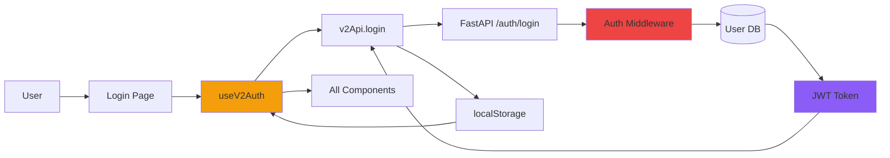
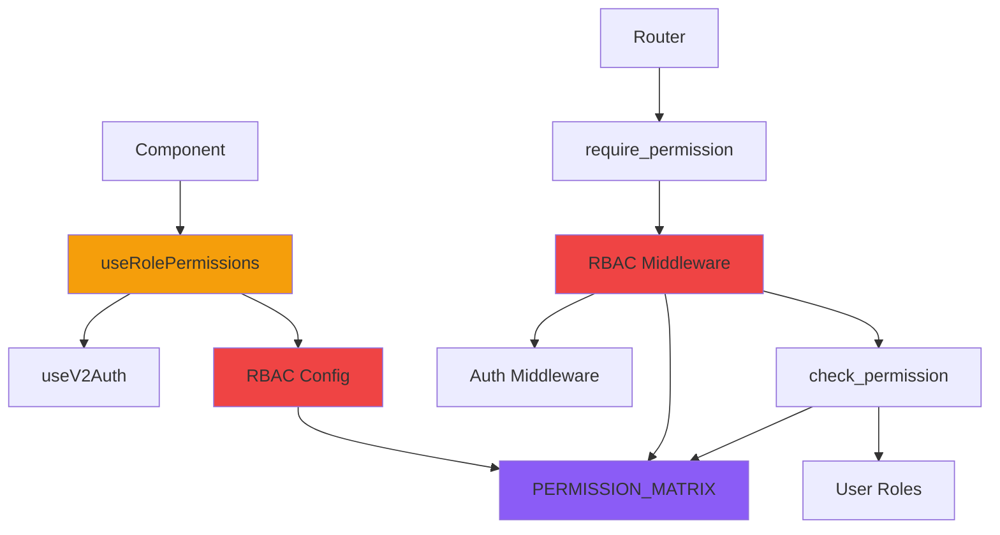
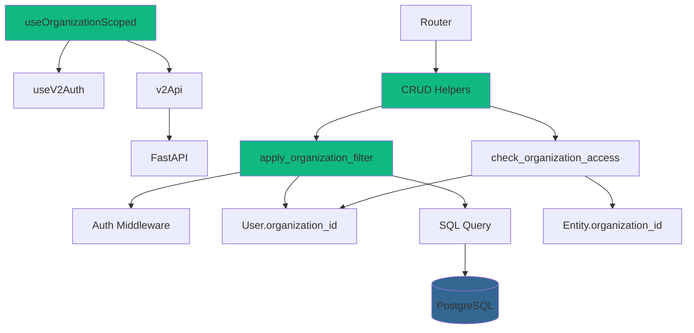
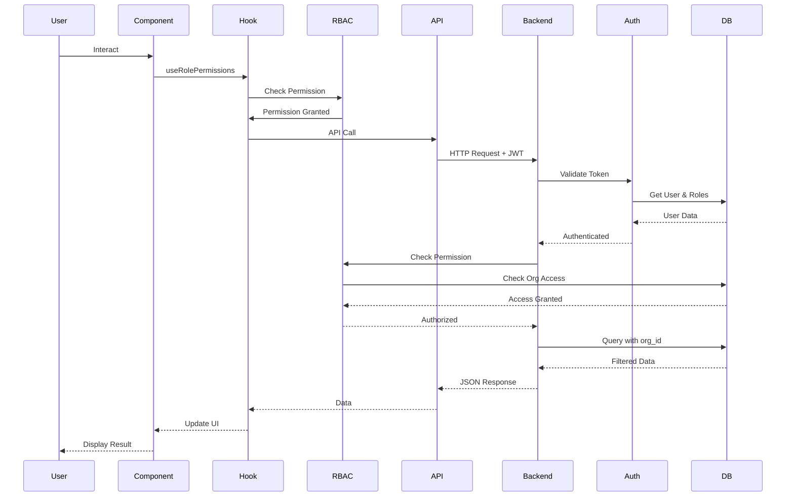

# Cross-Cutting Concerns Dependency Graph

## Pinaka v2 Cross-Cutting Dependencies

This diagram shows how authentication, RBAC, organization scoping, and typed API clients are used across the system.

```mermaid
graph TB
    subgraph "Authentication Flow"
        LoginPage[Login Page]
        V2AuthHook[useV2Auth Hook]
        V2APIClient[v2Api Client]
        AuthRouter[FastAPI auth_v2 Router]
        AuthMW[core/auth_v2.py]
        UserModel[User Model]
        JWT[JWT Token]
    end
    
    subgraph "RBAC System"
        RBACConfig[lib/rbac/rbacConfig.ts]
        RolePermsHook[useRolePermissions Hook]
        RBACHook[useRBAC Hook]
        RequireRoleHook[useRequireRole Hook]
        RBACRouter[FastAPI rbac Router]
        RBACMW[core/rbac.py]
        PermMatrix[PERMISSION_MATRIX]
        CheckPerm[check_permission]
    end
    
    subgraph "Organization Scoping"
        OrgScopeHook[useOrganizationScoped Hook]
        CRUDHelpers[core/crud_helpers.py]
        ApplyOrgFilter[apply_organization_filter]
        CheckOrgAccess[check_organization_access]
        OrgModel[Organization Model]
        UserOrg[User.organization_id]
    end
    
    subgraph "Typed API Client"
        OpenAPISpec[OpenAPI Spec]
        TypeGen[Type Generation]
        V2ClientNew[v2-client-new.ts]
        TypedClient[@pinaka/api-client]
        ReactQueryHooks[React Query Hooks]
        UseV2Data[useV2Data]
        UseUnifiedCRUD[useUnifiedCRUD]
    end
    
    subgraph "Frontend Components"
        ProtectedLayout[Protected Layout]
        UnifiedSidebar[Unified Sidebar]
        UnifiedNavbar[Unified Navbar]
        PortfolioPage[Portfolio Page]
        PlatformPage[Platform Page]
        WorkOrdersPage[Work Orders Page]
    end
    
    subgraph "Backend Routers"
        PropRouter[properties Router]
        LeaseRouter[leases Router]
        TenantRouter[tenants Router]
        WORouter[work_orders Router]
        UserRouter[users Router]
        OrgRouter[organizations Router]
    end
    
    %% Authentication Flow
    LoginPage --> V2AuthHook
    V2AuthHook --> V2APIClient
    V2APIClient --> AuthRouter
    AuthRouter --> AuthMW
    AuthMW --> UserModel
    AuthMW --> JWT
    JWT --> V2APIClient
    V2APIClient --> V2AuthHook
    V2AuthHook --> ProtectedLayout
    
    %% RBAC Flow - Frontend
    ProtectedLayout --> V2AuthHook
    UnifiedSidebar --> RolePermsHook
    UnifiedNavbar --> V2AuthHook
    PortfolioPage --> RolePermsHook
    PlatformPage --> RolePermsHook
    WorkOrdersPage --> RolePermsHook
    
    RolePermsHook --> V2AuthHook
    RolePermsHook --> RBACConfig
    RBACHook --> V2AuthHook
    RBACHook --> RBACConfig
    RequireRoleHook --> V2AuthHook
    
    RBACConfig --> PermissionsV2[permissions_v2.ts]
    
    %% RBAC Flow - Backend
    PropRouter --> RBACMW
    LeaseRouter --> RBACMW
    TenantRouter --> RBACMW
    WORouter --> RBACMW
    UserRouter --> RBACMW
    OrgRouter --> RBACMW
    
    RBACMW --> AuthMW
    RBACMW --> PermMatrix
    RBACMW --> CheckPerm
    CheckPerm --> UserModel
    CheckPerm --> PermMatrix
    
    RBACRouter --> RBACMW
    
    %% Organization Scoping - Frontend
    PortfolioPage --> OrgScopeHook
    WorkOrdersPage --> OrgScopeHook
    
    OrgScopeHook --> V2AuthHook
    OrgScopeHook --> V2APIClient
    
    %% Organization Scoping - Backend
    PropRouter --> CRUDHelpers
    LeaseRouter --> CRUDHelpers
    TenantRouter --> CRUDHelpers
    WORouter --> CRUDHelpers
    UserRouter --> CRUDHelpers
    OrgRouter --> CRUDHelpers
    
    CRUDHelpers --> AuthMW
    CRUDHelpers --> ApplyOrgFilter
    CRUDHelpers --> CheckOrgAccess
    ApplyOrgFilter --> UserOrg
    CheckOrgAccess --> OrgModel
    CheckOrgAccess --> UserOrg
    
    %% Typed API Client Flow
    FastAPIRouters[FastAPI Routers] --> OpenAPISpec
    OpenAPISpec --> TypeGen
    TypeGen --> TypedClient
    TypedClient --> V2ClientNew
    V2ClientNew --> ReactQueryHooks
    ReactQueryHooks --> UseV2Data
    ReactQueryHooks --> UseUnifiedCRUD
    
    UseV2Data --> PortfolioPage
    UseV2Data --> WorkOrdersPage
    UseUnifiedCRUD --> PortfolioPage
    UseUnifiedCRUD --> WorkOrdersPage
    
    %% Cross-cutting usage
    PropRouter --> AuthMW
    PropRouter --> RBACMW
    PropRouter --> CRUDHelpers
    
    LeaseRouter --> AuthMW
    LeaseRouter --> RBACMW
    LeaseRouter --> CRUDHelpers
    
    TenantRouter --> AuthMW
    TenantRouter --> RBACMW
    TenantRouter --> CRUDHelpers
    
    WORouter --> AuthMW
    WORouter --> RBACMW
    WORouter --> CRUDHelpers
    
    style V2AuthHook fill:#f59e0b
    style RBACConfig fill:#ef4444
    style RBACMW fill:#ef4444
    style CRUDHelpers fill:#10b981
    style V2ClientNew fill:#00d4aa
    style TypedClient fill:#8b5cf6
```

## Authentication Dependency Chain



## RBAC Dependency Chain



## Organization Scoping Dependency Chain



## Typed API Client Generation Flow

```mermaid
graph LR
    FastAPI[FastAPI Routers] --> Pydantic[Pydantic Schemas]
    Pydantic --> OpenAPI[OpenAPI Spec]
    OpenAPI --> TypeGen[Type Generation]
    TypeGen --> Types[TypeScript Types]
    Types --> TypedClient[Typed API Client]
    TypedClient --> V2ClientNew[v2-client-new.ts]
    V2ClientNew --> Hooks[React Query Hooks]
    Hooks --> Components[Components]
    
    style FastAPI fill:#3b82f6
    style OpenAPI fill:#8b5cf6
    style TypedClient fill:#00d4aa
    style Hooks fill:#ff4154
```



## Complete Cross-Cutting Flow



