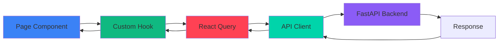
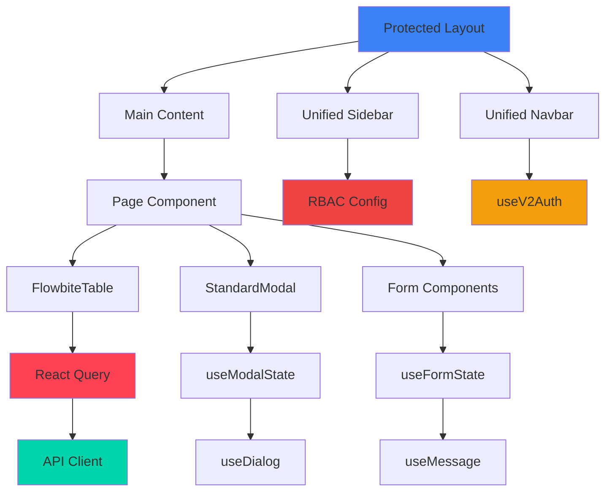

# Frontend Dependency Graph

## Pinaka v2 Frontend Dependencies

This diagram shows the complete dependency structure of the Next.js frontend, including App Router pages, components, hooks, API clients, and their relationships.

```mermaid
graph TB
    subgraph "Next.js App Router"
        RootLayout[app/layout.jsx]
        ProtectedLayout[app/(protected)/layout.tsx]
        AuthLayout[app/auth/login/page.tsx]
        OnboardLayout[app/onboarding/layout.tsx]
    end
    
    subgraph "Protected Pages"
        PortfolioPage[app/(protected)/portfolio/page.jsx]
        PortfolioProps[app/(protected)/portfolio/properties/page.jsx]
        PortfolioUnits[app/(protected)/portfolio/units/page.jsx]
        PortfolioLeases[app/(protected)/portfolio/leases/page.jsx]
        PortfolioTenants[app/(protected)/portfolio/tenants/page.jsx]
        PortfolioLandlords[app/(protected)/portfolio/landlords/page.jsx]
        PortfolioVendors[app/(protected)/portfolio/vendors/page.jsx]
        PlatformPage[app/(protected)/platform/page.jsx]
        PlatformOrgs[app/(protected)/platform/organizations/page.jsx]
        PlatformUsers[app/(protected)/platform/users/page.jsx]
        PlatformRBAC[app/(protected)/platform/rbac/page.jsx]
        WorkOrdersPage[app/(protected)/work-orders-v2/page.jsx]
        MessagesPage[app/(protected)/messages/page.jsx]
        HelpPage[app/(protected)/help/page.tsx]
        SettingsPage[app/settings/page.jsx]
    end
    
    subgraph "Onboarding Pages"
        OnboardStart[app/onboarding/start/page.tsx]
        OnboardProfile[app/onboarding/profile/page.tsx]
        OnboardOrg[app/onboarding/organization/page.tsx]
        OnboardProps[app/onboarding/properties/page.tsx]
        OnboardPrefs[app/onboarding/preferences/page.tsx]
        OnboardComplete[app/onboarding/complete/page.tsx]
    end
    
    subgraph "Layout Components"
        ProtectedLayoutWrapper[components/layout/ProtectedLayoutWrapper.tsx]
        UnifiedSidebar[components/layout/UnifiedSidebar.tsx]
        UnifiedNavbar[components/layout/UnifiedNavbar.tsx]
        OnboardingLayout[components/onboarding/OnboardingLayout.tsx]
        OnboardingStepper[components/onboarding/OnboardingStepper.tsx]
    end
    
    subgraph "Page Components"
        PortfolioUI[components/pages/shared/Portfolio/ui.jsx]
        MaintenanceClient[components/shared/MaintenanceClient.jsx]
        MessagesClient[components/shared/MessagesClient.jsx]
        LibraryClient[components/shared/LibraryClient.jsx]
        FinancialReports[components/shared/FinancialReports.jsx]
    end
    
    subgraph "Shared UI Components"
        FlowbiteTable[components/shared/FlowbiteTable.jsx]
        StandardModal[components/shared/StandardModal.jsx]
        FormTextInput[components/shared/FormFields/FormTextInput.jsx]
        FormSelect[components/shared/FormFields/FormSelect.jsx]
        FormDatePicker[components/shared/FormFields/FormDatePicker.jsx]
        FormPhoneInput[components/shared/FormFields/FormPhoneInput.jsx]
        PageLayout[components/shared/PageLayout.jsx]
        PageHeader[components/shared/PageHeader.jsx]
    end
    
    subgraph "A11y Components"
        SkipToContent[components/a11y/SkipToContent.tsx]
        LiveRegion[components/a11y/LiveRegion.tsx]
        FocusTrap[components/a11y/FocusTrap.tsx]
        UseFocusMgmt[components/a11y/useFocusManagement.ts]
        UseAnnouncement[components/a11y/useAnnouncement.ts]
    end
    
    subgraph "Tour Components"
        TourProvider[components/tour/TourProvider.tsx]
        GuidedTour[components/tour/GuidedTour.tsx]
        FirstTimeModal[components/tour/FirstTimeModal.tsx]
    end
    
    subgraph "Help Components"
        HelpSearch[components/help/HelpSearch.tsx]
        HelpCategoryList[components/help/HelpCategoryList.tsx]
        HelpContentRenderer[components/help/HelpContentRenderer.tsx]
    end
    
    subgraph "Custom Hooks - Data"
        UseV2Data[lib/hooks/useV2Data.ts]
        UseDataQueries[lib/hooks/useDataQueries.ts]
        UseUnifiedCRUD[lib/hooks/useUnifiedCRUD.ts]
        UseV2CRUD[lib/hooks/useV2CRUD.js]
        UsePortfolio[lib/hooks/usePortfolio.js]
    end
    
    subgraph "Custom Hooks - Auth & RBAC"
        UseV2Auth[lib/hooks/useV2Auth.ts]
        UseRolePermissions[lib/hooks/useRolePermissions.ts]
        UseRBAC[lib/hooks/useRBAC.ts]
        UseRequireRole[lib/hooks/useRequireRole.ts]
    end
    
    subgraph "Custom Hooks - UI State"
        UseFormState[lib/hooks/useFormState.js]
        UseModalState[lib/hooks/useModalState.js]
        UseDialog[lib/hooks/useDialog.js]
        UseMessage[lib/hooks/useMessage.js]
        UseLoading[lib/hooks/useLoading.js]
        UseTourState[lib/hooks/useTourState.ts]
    end
    
    subgraph "Custom Hooks - Features"
        UseOnboarding[lib/hooks/useOnboarding.ts]
        UseMaintenanceRequests[lib/hooks/useMaintenanceRequests.js]
        UseMaintenanceActions[lib/hooks/useMaintenanceActions.js]
        UseDocumentVault[lib/hooks/useDocumentVault.js]
        UseDocumentUpload[lib/hooks/useDocumentUpload.js]
        UseBulkOperations[lib/hooks/useBulkOperations.js]
    end
    
    subgraph "API Clients"
        V2Client[lib/api/v2-client.ts]
        V2ClientNew[lib/api/v2-client-new.ts]
        AdminAPI[lib/api/admin-api.ts]
        V1Client[lib/api/v1-client.ts]
    end
    
    subgraph "RBAC Configuration"
        RBACConfig[lib/rbac/rbacConfig.ts]
        PermissionsV2[lib/rbac/permissions_v2.ts]
    end
    
    subgraph "React Query"
        ReactQuery[@tanstack/react-query]
        QueryClient[QueryClient]
        UseQuery[useQuery]
        UseMutation[useMutation]
    end
    
    subgraph "Backend API"
        FastAPI[FastAPI Backend]
    end
    
    %% App Router structure
    RootLayout --> ProtectedLayout
    RootLayout --> AuthLayout
    RootLayout --> OnboardLayout
    
    ProtectedLayout --> ProtectedLayoutWrapper
    OnboardLayout --> OnboardingLayout
    
    %% Protected pages
    ProtectedLayout --> PortfolioPage
    ProtectedLayout --> PortfolioProps
    ProtectedLayout --> PortfolioUnits
    ProtectedLayout --> PortfolioLeases
    ProtectedLayout --> PortfolioTenants
    ProtectedLayout --> PortfolioLandlords
    ProtectedLayout --> PortfolioVendors
    ProtectedLayout --> PlatformPage
    ProtectedLayout --> PlatformOrgs
    ProtectedLayout --> PlatformUsers
    ProtectedLayout --> PlatformRBAC
    ProtectedLayout --> WorkOrdersPage
    ProtectedLayout --> MessagesPage
    ProtectedLayout --> HelpPage
    ProtectedLayout --> SettingsPage
    
    %% Onboarding pages
    OnboardLayout --> OnboardStart
    OnboardLayout --> OnboardProfile
    OnboardLayout --> OnboardOrg
    OnboardLayout --> OnboardProps
    OnboardLayout --> OnboardPrefs
    OnboardLayout --> OnboardComplete
    
    %% Layout component dependencies
    ProtectedLayoutWrapper --> UnifiedSidebar
    ProtectedLayoutWrapper --> UnifiedNavbar
    ProtectedLayoutWrapper --> SkipToContent
    ProtectedLayoutWrapper --> LiveRegion
    ProtectedLayoutWrapper --> FocusTrap
    ProtectedLayoutWrapper --> UseFocusMgmt
    ProtectedLayoutWrapper --> UseAnnouncement
    ProtectedLayoutWrapper --> TourProvider
    ProtectedLayoutWrapper --> UseV2Auth
    
    UnifiedSidebar --> UseRolePermissions
    UnifiedSidebar --> UseTourState
    UnifiedNavbar --> UseV2Auth
    UnifiedNavbar --> UseTourState
    
    OnboardingLayout --> OnboardingStepper
    OnboardingLayout --> UseOnboarding
    
    %% Page component dependencies
    PortfolioPage --> PortfolioUI
    PortfolioUI --> UseDataQueries
    PortfolioUI --> UsePortfolio
    PortfolioUI --> FlowbiteTable
    
    WorkOrdersPage --> MaintenanceClient
    MaintenanceClient --> UseV2Data
    MaintenanceClient --> UseMaintenanceRequests
    MaintenanceClient --> UseMaintenanceActions
    MaintenanceClient --> FlowbiteTable
    MaintenanceClient --> StandardModal
    
    MessagesPage --> MessagesClient
    MessagesClient --> UseV2Data
    MessagesClient --> FlowbiteTable
    
    HelpPage --> HelpSearch
    HelpPage --> HelpCategoryList
    HelpPage --> HelpContentRenderer
    
    SettingsPage --> UseV2Auth
    
    %% Onboarding page dependencies
    OnboardStart --> UseOnboarding
    OnboardProfile --> UseOnboarding
    OnboardOrg --> UseOnboarding
    OnboardProps --> UseOnboarding
    OnboardPrefs --> UseOnboarding
    OnboardComplete --> UseOnboarding
    
    %% Shared component dependencies
    FlowbiteTable --> ReactQuery
    StandardModal --> UseModalState
    FormTextInput --> UseFormState
    FormSelect --> UseFormState
    FormDatePicker --> UseFormState
    FormPhoneInput --> UseFormState
    PageLayout --> UseLoading
    
    %% Hook dependencies - Data
    UseV2Data --> ReactQuery
    UseV2Data --> V2Client
    UseDataQueries --> UseV2Data
    UseDataQueries --> ReactQuery
    UseUnifiedCRUD --> ReactQuery
    UseUnifiedCRUD --> V2Client
    UseV2CRUD --> ReactQuery
    UseV2CRUD --> V2Client
    UsePortfolio --> UseDataQueries
    
    %% Hook dependencies - Auth & RBAC
    UseV2Auth --> V2Client
    UseRolePermissions --> UseV2Auth
    UseRolePermissions --> RBACConfig
    UseRBAC --> UseV2Auth
    UseRBAC --> RBACConfig
    UseRequireRole --> UseV2Auth
    
    %% Hook dependencies - UI State
    UseFormState --> UseMessage
    UseModalState --> UseDialog
    UseDialog --> UseMessage
    
    %% Hook dependencies - Features
    UseOnboarding --> V2Client
    UseMaintenanceRequests --> UseV2Data
    UseMaintenanceActions --> V2Client
    UseDocumentVault --> UseV2Data
    UseDocumentUpload --> V2Client
    UseBulkOperations --> V2Client
    
    %% API Client dependencies
    V2Client --> FastAPI
    V2ClientNew --> FastAPI
    AdminAPI --> FastAPI
    V1Client --> FastAPI
    
    %% RBAC dependencies
    RBACConfig --> PermissionsV2
    
    %% React Query setup
    ReactQuery --> QueryClient
    UseQuery --> ReactQuery
    UseMutation --> ReactQuery
    
    style RootLayout fill:#3b82f6
    style ProtectedLayoutWrapper fill:#10b981
    style UseV2Auth fill:#f59e0b
    style UseRolePermissions fill:#ef4444
    style V2Client fill:#00d4aa
    style ReactQuery fill:#ff4154
    style FastAPI fill:#8b5cf6
```

## Page → Hook → API Flow



## Component Hierarchy



