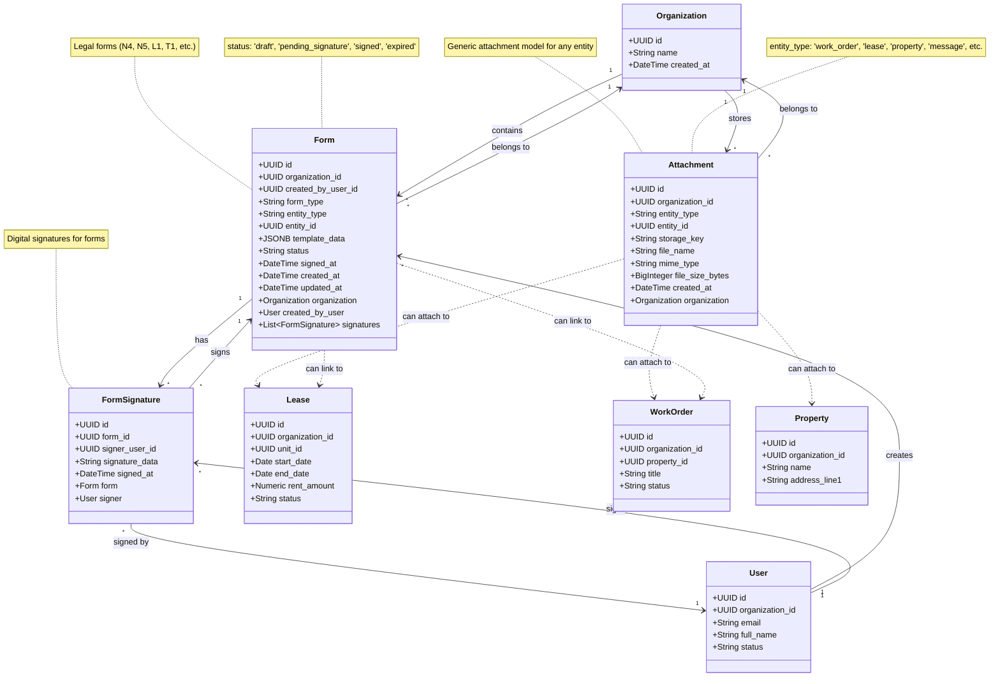

# UML Class Diagram - Document Domain

## Pinaka v2 Document Domain

This UML class diagram shows the document management domain models including attachments, forms, and signatures.

## Relationships

- **Organization → Attachment**: One-to-many (organization stores attachments)
- **Organization → Form**: One-to-many (organization contains forms)
- **User → Form**: One-to-many (user creates forms)
- **User → FormSignature**: One-to-many (user signs forms)
- **Form → FormSignature**: One-to-many (form has signatures)
- **Attachment → Entity**: Polymorphic relationship (can attach to any entity via entity_type + entity_id)
- **Form → Entity**: Optional relationship (can link to lease, work_order, etc.)

## Key Attributes

### Attachment
- **entity_type**: Required entity type ('work_order', 'lease', 'property', 'message', etc.)
- **entity_id**: Required UUID of the entity
- **storage_key**: File path or S3 key
- **file_name**: Original file name
- **mime_type**: MIME type of the file
- **file_size_bytes**: File size in bytes
- **Generic model**: Can attach to any entity in the system

### Form
- **form_type**: Required form type ('N4', 'N5', 'L1', 'T1', etc.)
- **entity_type**: Optional entity type ('lease', 'work_order', etc.)
- **entity_id**: Optional UUID of linked entity
- **template_data**: JSONB for form field values
- **status**: 'draft', 'pending_signature', 'signed', 'expired'
- **signed_at**: Timestamp when form was fully signed

### FormSignature
- **form_id**: Foreign key to Form
- **signer_user_id**: Foreign key to User (who signed)
- **signature_data**: Base64 encoded signature image
- **signed_at**: Timestamp when signature was applied

## Document Types

### Attachments
- Work order attachments (photos, documents)
- Lease documents
- Property documents
- Message attachments
- Receipt attachments (for expenses)

### Forms
- **N4**: Notice to End Tenancy
- **N5**: Notice to End Tenancy for Cause
- **L1**: Application to End Tenancy
- **T1**: Tenant Application
- Other legal forms

## Polymorphic Relationships

The `Attachment` model uses a polymorphic relationship pattern:
- **entity_type**: String identifying the entity type
- **entity_id**: UUID of the specific entity
- This allows attachments to be linked to any entity in the system

Similarly, `Form` can optionally link to entities:
- **entity_type**: Optional entity type
- **entity_id**: Optional entity UUID
- Forms can be standalone or linked to leases, work orders, etc.

