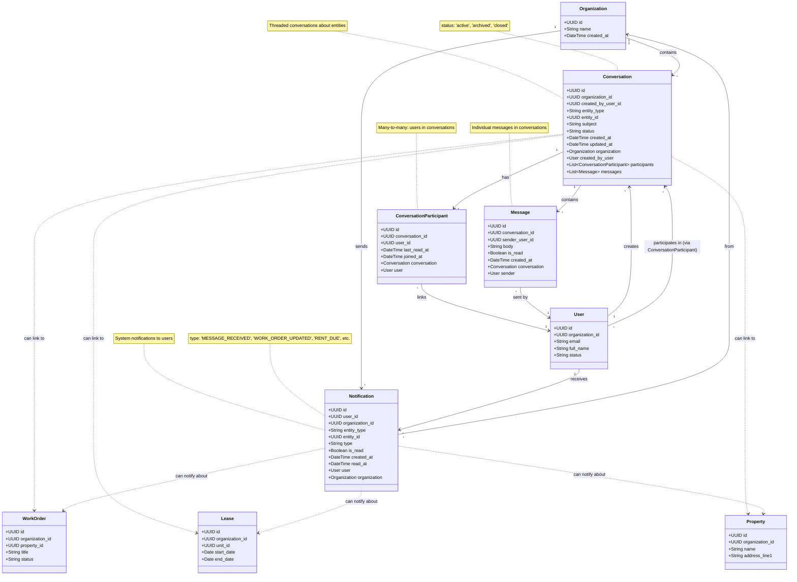

# UML Class Diagram - Messaging Domain

## Pinaka v2 Messaging Domain

This UML class diagram shows the messaging and communication domain models.

## Relationships

- **Organization → Conversation**: One-to-many (organization contains conversations)
- **Organization → Notification**: One-to-many (organization sends notifications)
- **User → Conversation**: One-to-many (user creates conversations)
- **User → Conversation**: Many-to-many via ConversationParticipant (users participate in conversations)
- **Conversation → ConversationParticipant**: One-to-many (conversation has participants)
- **ConversationParticipant → User**: Many-to-one (participant is a user)
- **Conversation → Message**: One-to-many (conversation contains messages)
- **Message → User**: Many-to-one (message sent by user)
- **User → Notification**: One-to-many (user receives notifications)
- **Notification → Organization**: Many-to-one (notification from organization)

## Key Attributes

### Conversation
- **entity_type**: Optional entity type ('work_order', 'lease', 'property', etc.)
- **entity_id**: Optional UUID of linked entity
- **subject**: Optional conversation subject
- **status**: 'active', 'archived', 'closed'
- **created_by_user_id**: User who started the conversation
- **Can be linked to entities**: Conversations can be about work orders, leases, properties, etc.

### ConversationParticipant
- **conversation_id**: Foreign key to Conversation
- **user_id**: Foreign key to User
- **last_read_at**: Timestamp when user last read messages
- **joined_at**: Timestamp when user joined conversation
- **Unique constraint**: (conversation_id, user_id)

### Message
- **conversation_id**: Foreign key to Conversation
- **sender_user_id**: Foreign key to User (who sent the message)
- **body**: Required message text
- **is_read**: Boolean flag for read status
- **created_at**: Timestamp when message was sent

### Notification
- **user_id**: Foreign key to User (who receives notification)
- **organization_id**: Foreign key to Organization
- **entity_type**: Required entity type
- **entity_id**: Required UUID of entity
- **type**: Required notification type ('MESSAGE_RECEIVED', 'WORK_ORDER_UPDATED', 'RENT_DUE', etc.)
- **is_read**: Boolean flag for read status
- **read_at**: Timestamp when notification was read

## Polymorphic Relationships

Both `Conversation` and `Notification` use polymorphic relationships:

### Conversation
- Can be linked to any entity via `entity_type` + `entity_id`
- Examples: Work order conversations, lease conversations, property conversations
- Can also be standalone (no entity link)

### Notification
- Always linked to an entity via `entity_type` + `entity_id`
- Examples: Work order notifications, lease notifications, message notifications
- Notification type indicates what happened to the entity

## Notification Types

- **MESSAGE_RECEIVED**: New message in conversation
- **WORK_ORDER_UPDATED**: Work order status changed
- **RENT_DUE**: Rent payment due
- **LEASE_EXPIRING**: Lease expiring soon
- **TASK_DUE**: Task due date approaching
- **FORM_SIGNED**: Form signature completed
- Other entity-specific notifications

