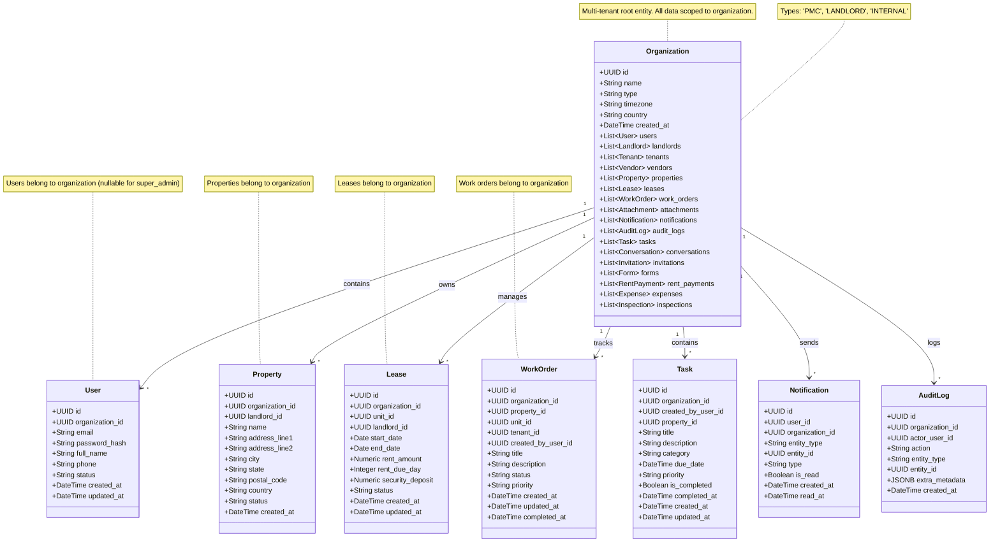

# UML Class Diagram - Organization Domain

## Pinaka v2 Organization Domain

This UML class diagram shows the organization domain model and its relationships with all other entities.

## Organization Scoping

All entities in the system are scoped to an organization:

- **User**: `organization_id` (nullable for SUPER_ADMIN)
- **Property**: `organization_id` (required)
- **Lease**: `organization_id` (required)
- **WorkOrder**: `organization_id` (required)
- **Task**: `organization_id` (required)
- **Notification**: `organization_id` (required)
- **AuditLog**: `organization_id` (nullable for global actions)

## Organization Types

- **PMC**: Property Management Company
- **LANDLORD**: Individual landlord organization
- **INTERNAL**: Internal Pinaka organization

## Key Relationships

- **Organization → User**: One-to-many (organization contains users)
- **Organization → Property**: One-to-many (organization owns properties)
- **Organization → Lease**: One-to-many (organization manages leases)
- **Organization → WorkOrder**: One-to-many (organization tracks work orders)
- **Organization → Task**: One-to-many (organization contains tasks)
- **Organization → Notification**: One-to-many (organization sends notifications)
- **Organization → AuditLog**: One-to-many (organization logs actions)

