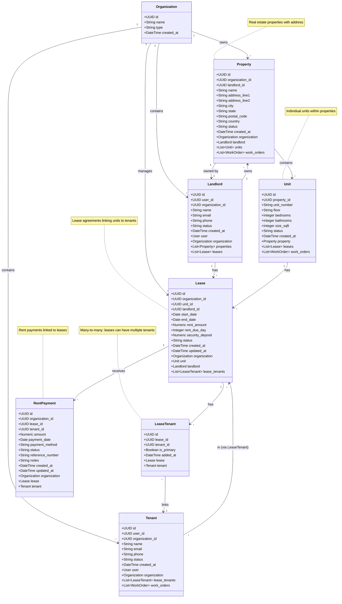

# UML Class Diagram - Portfolio Domain

## Pinaka v2 Portfolio Domain (Properties, Units, Landlords, Tenants, Leases)

This UML class diagram shows the core portfolio management domain models.

## Relationships

- **Organization → Property**: One-to-many (organization owns properties)
- **Organization → Landlord**: One-to-many (organization contains landlords)
- **Organization → Tenant**: One-to-many (organization contains tenants)
- **Organization → Lease**: One-to-many (organization manages leases)
- **Property → Unit**: One-to-many (property contains units)
- **Property → Landlord**: Many-to-one (property owned by landlord)
- **Landlord → Property**: One-to-many (landlord owns properties)
- **Landlord → Lease**: One-to-many (landlord has leases)
- **Unit → Lease**: One-to-many (unit has leases)
- **Lease → Tenant**: Many-to-many via LeaseTenant (lease can have multiple tenants)
- **Lease → RentPayment**: One-to-many (lease receives rent payments)

## Key Attributes

### Property
- **address_line1**: Required address line
- **status**: 'active', 'inactive', 'maintenance'
- **landlord_id**: Optional (property may not have assigned landlord)

### Unit
- **unit_number**: Required identifier within property
- **status**: 'vacant', 'occupied', 'maintenance'
- **bedrooms/bathrooms**: Optional unit details
- **size_sqft**: Optional square footage

### Lease
- **start_date/end_date**: Required lease period
- **rent_amount**: Required monthly rent
- **rent_due_day**: Day of month rent is due (1-31)
- **security_deposit**: Optional security deposit amount
- **status**: 'pending', 'active', 'terminated', 'expired'

### LeaseTenant
- **is_primary**: Boolean flag for primary tenant
- **Unique constraint**: (lease_id, tenant_id)

### RentPayment
- **amount**: Payment amount
- **payment_date**: Date payment was made
- **payment_method**: 'check', 'bank_transfer', 'credit_card', 'cash'
- **status**: 'pending', 'completed', 'failed', 'refunded'
- **reference_number**: Optional payment reference

