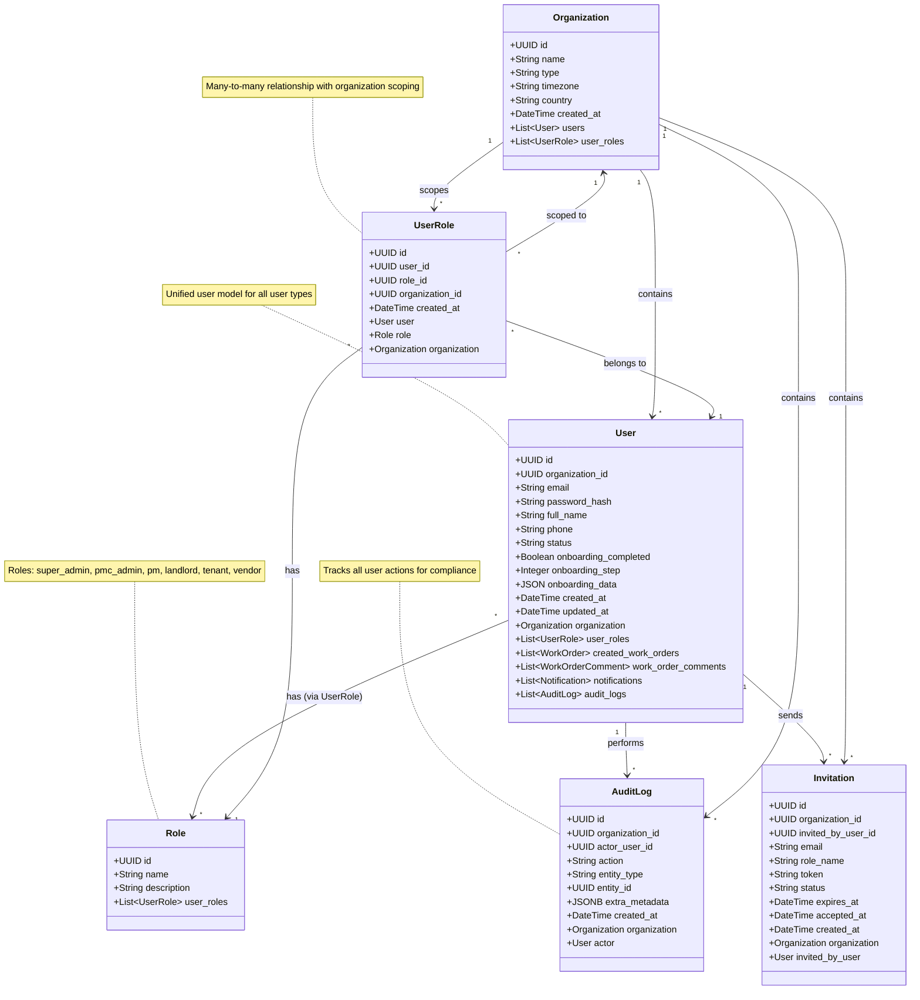

# UML Class Diagram - Users & RBAC Domain

## Pinaka v2 Users and Role-Based Access Control

This UML class diagram shows the user authentication and RBAC domain models.

## Relationships

- **Organization → User**: One-to-many (organization contains users)
- **User → Role**: Many-to-many via UserRole (users can have multiple roles)
- **UserRole**: Join table with organization scoping (users can have different roles in different organizations)
- **User → AuditLog**: One-to-many (user performs actions)
- **User → Invitation**: One-to-many (user sends invitations)

## Key Attributes

### User
- **id**: UUID primary key
- **email**: Unique identifier for authentication
- **password_hash**: Bcrypt hashed password
- **status**: 'active', 'invited', 'suspended'
- **onboarding_completed**: Boolean flag for onboarding flow
- **onboarding_step**: Current step in onboarding process
- **onboarding_data**: JSON storage for onboarding progress

### Role
- **name**: Unique role identifier ('super_admin', 'pmc_admin', 'pm', 'landlord', 'tenant', 'vendor')
- **description**: Human-readable role description

### UserRole
- **user_id**: Foreign key to User
- **role_id**: Foreign key to Role
- **organization_id**: Foreign key to Organization (for multi-tenant scoping)
- **Unique constraint**: (user_id, role_id, organization_id)

### AuditLog
- **actor_user_id**: User who performed the action
- **action**: Action type ('ROLE_CHANGED', 'USER_IMPERSONATED', etc.)
- **entity_type**: Type of entity affected
- **entity_id**: ID of entity affected
- **extra_metadata**: JSONB for additional context

