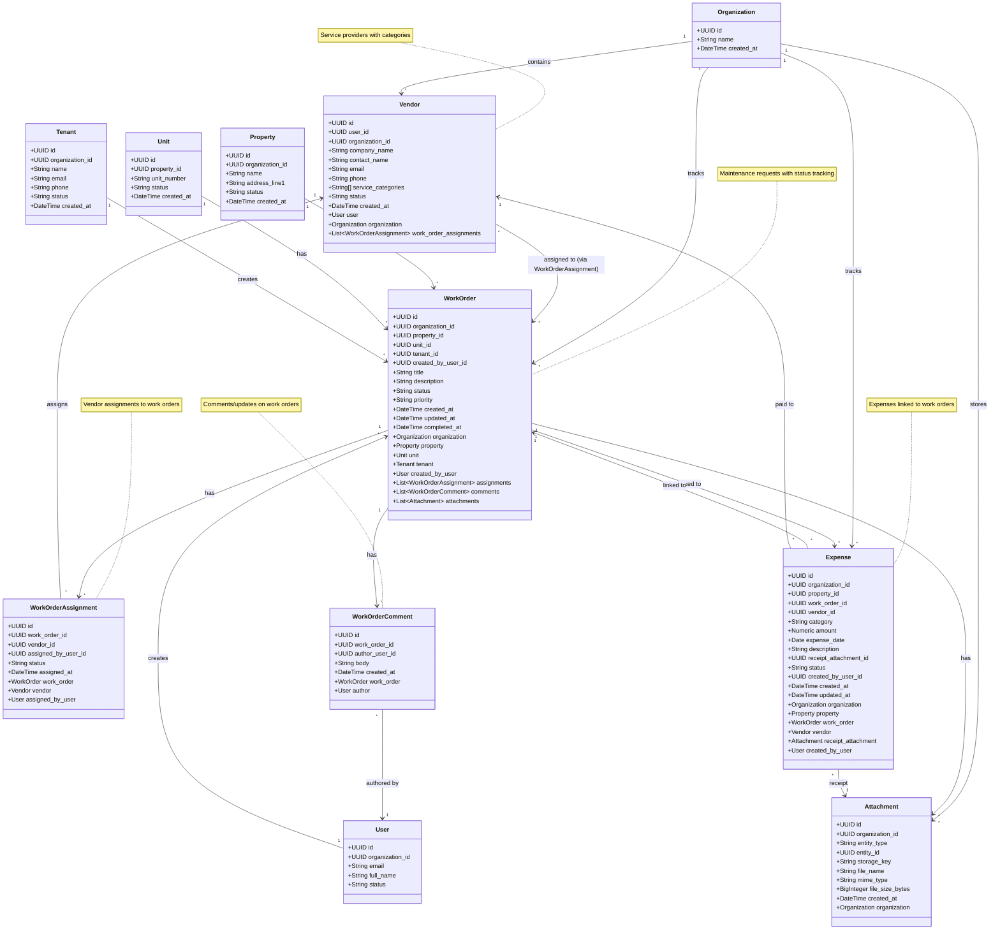

# UML Class Diagram - Vendor & Work Order Domain

## Pinaka v2 Vendor and Work Order Domain

This UML class diagram shows the maintenance and vendor management domain models.

## Relationships

- **Organization → Vendor**: One-to-many (organization contains vendors)
- **Organization → WorkOrder**: One-to-many (organization tracks work orders)
- **Vendor → WorkOrder**: Many-to-many via WorkOrderAssignment (vendors assigned to work orders)
- **WorkOrder → WorkOrderAssignment**: One-to-many (work order has assignments)
- **WorkOrder → WorkOrderComment**: One-to-many (work order has comments)
- **WorkOrder → Attachment**: One-to-many (work order has attachments)
- **WorkOrder → Expense**: One-to-many (work order has expenses)
- **Property → WorkOrder**: One-to-many (property has work orders)
- **Unit → WorkOrder**: One-to-many (unit has work orders)
- **Tenant → WorkOrder**: One-to-many (tenant creates work orders)
- **User → WorkOrder**: One-to-many (user creates work orders)
- **Expense → WorkOrder**: Many-to-one (expense linked to work order)
- **Expense → Vendor**: Many-to-one (expense paid to vendor)

## Key Attributes

### Vendor
- **company_name**: Required vendor company name
- **contact_name**: Optional contact person name
- **service_categories**: Array of service categories (e.g., ['plumbing', 'electrical'])
- **status**: 'active', 'inactive', 'suspended'

### WorkOrder
- **title**: Required work order title
- **description**: Optional detailed description
- **status**: 'new', 'in_progress', 'waiting_on_vendor', 'completed', 'canceled'
- **priority**: 'low', 'medium', 'high', 'emergency'
- **completed_at**: Timestamp when work order was completed

### WorkOrderAssignment
- **status**: 'assigned', 'accepted', 'rejected', 'completed'
- **assigned_at**: Timestamp when assignment was made
- **assigned_by_user_id**: User who made the assignment

### WorkOrderComment
- **body**: Required comment text
- **author_user_id**: User who wrote the comment
- **created_at**: Timestamp of comment

### Expense
- **category**: Required expense category ('maintenance', 'utilities', 'insurance', 'taxes', etc.)
- **amount**: Required expense amount
- **expense_date**: Date expense was incurred
- **receipt_attachment_id**: Optional link to receipt attachment
- **status**: 'pending', 'approved', 'rejected', 'paid'

